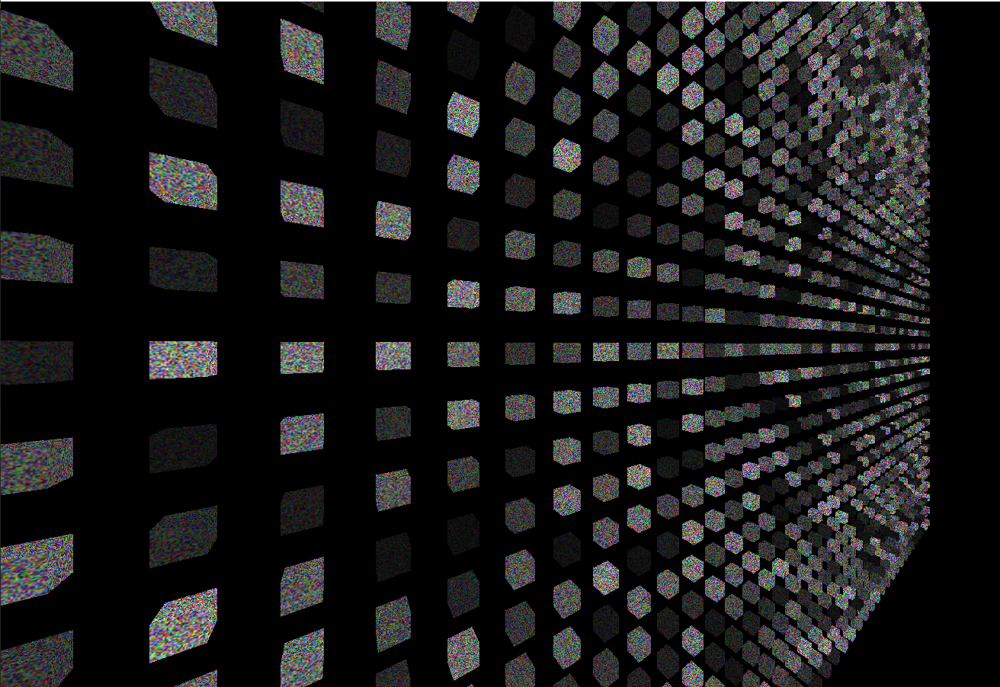

# Bindless Texture

Bindless texture 允许 shader 直接通过 integer handle, (从SSBOs中)访问大量 textures, 而无需 bind texture unit.

## Overview

OpenGL 4.5 只有至少 16 个 texture units 可供 shader 使用 (即使许多驱动支持 32 个或更多)。  
因此这个限制让我们很难处理如 merge many different draw calls with different material textures，或者在延迟光照阶段访问许多阴影贴图的事情。  

过去有两种主要方法可以解决这个问题：
- Use array textures to combine multiple textures of the same dimensions
- Use texture atlases to allow one large texture to represent many smaller textures


Bindless textures 是第三种替代方案。bindless textures 允许我们手动将 texture 标记为驻留(resident)在 GPU 上，然后使用 UBO 或 SSBO 将其 handle 传递给 shader，而不是将 texture 显式绑定到 texture unit。

这种方法还可能提高性能。如果您的渲染器花费了大量时间在不同 drawcall 之间 bind/unbind textures，那 bindless 方法可大量减少驱动程序开销。  
这是因为你可以在帧开始时确定需要哪些textures，将它们全部标记为 同时resident驻留，然后将这些textures用于帧其余部分的任意数量的drawcalls。


### Downside of Bindless Texure

有两个主要缺点：
1. RenderDoc 届时还不支持它们，因此您需要使用支持的图形debugger，例如 Nvidia NSight
2. Bindless texure 从未成为 OpenGL 的核心，因此即使在 4.6 中它仍然是一个扩展。  
NVIDIA 和 AMD 都有很多完全支持它的硬件，但您仍需要仔细检查 vendor 是否支持它。


## API Overview

我们将重点关注三个主要的 API 函数

### Retrieving Texture Handles

```cpp
GLuint64 glGetTextureHandleARB(GLuint texture​);
```

这个函数的作用是接收一个有效的纹理，并返回一个表示该纹理的 64 位句柄。这个句柄可以直接插入到 UBO 或 SSBO 中。

如果你多次使用同一个纹理调用这个函数，它将始终返回相同的句柄。因此，你可以在纹理创建后调用一次此函数，然后在纹理的整个生命周期中使用这个句柄，而无需再次调用此函数。

::: info
Khronos 在他们的 Wiki 中声明：一旦为texture/sampler创建了handle，其状态就不能再更改。  
对于 Buffer Textures，这包括当前附加到它的 buffer object（这也意味着你不能为没有附加 buffer 的 buffer texture 创建 handle）。  
不仅如此，在这种情况下，buffer object 本身也会变得不可变；它不能通过 `glBufferData` 重新分配。不过与 texture 一样，其存储仍然可以 mapped，并且其数据可以通过其他函数正常修改。”
:::

因此，一般的指导原则是，在为 texture 或 buffer texture 执行所有初始设置后，调用此函数。从那时起，你将只能更改 texture data，而不能更改与纹理相关的其他状态。


### Making Texture Handles Resident (and Non Resident)

```cpp
// handle is what is returned by glGetTextureHandleARB
void glMakeTextureHandleResidentARB(GLuint64 handle​);
```

由于我们不再绑定到 uniform texture units，因此我们需要在使用 handle 之前告诉驱动程序我们打算使用哪些 handles。否则，它将无从知晓。

一旦使一个纹理句柄驻留，它将保持驻留状态，直到你显式地告诉驱动程序使其非驻留。这意味着，如果你有一组将在程序的整个生命周期中存在的纹理，你可以在程序开始时使它们驻留，并在程序结束前保持其驻留状态。

```cpp
// handle is what is returned by glGetTextureHandleARB
void glMakeTextureHandleNonResidentARB(GLuint64 handle​);
```
这个函数允许你告诉驱动程序，该句柄不再被任何 shader 使用，可以将其从驻留列表中移除。


## Example: 1600 textures in a single shader

为了展示如何使用这些功能，我们将随机生成1600个textures（每个cube实例一个），并使它们都驻留以供shader使用。我们只会使用一个 instanced draw call 来绘制1600个cubes。

### 1. Cube VertexData & Transforms in SSBOs

首先，我们将生成cube的顶点数据，并插入到一个 SSBO 中。

```cpp
struct VertexData {
    float position[3];
    float uv[2];
    float normal[3];
};

// In main or some other function
std::vector<VertexData> vertices;
// ... code to insert a single cube data into vertices ... 

const int numVertices = data.size();
GLuint verticesBuffer;

glCreateBuffers(1, &verticesBuffer);
glNamedBufferStorage(
    verticesBuffer,
    sizeof(VertexData) * vertices.size(),
    (const void *)vertices.data(),
    GL_DYNAMIC_STORAGE_BIT
);
```

接下来，我们将创建1600个不同的transforms，每个cube实例一个。这些transforms也将被插入到一个SSBO中。

```cpp
std::vector<glm::mat4> instancedMatrices;

// Each one will be 5 units apart from the others in the x/y direction
for (size_t x = 0; x < 200; x += 5) {
    for (size_t y = 0; y < 200; y += 5) {
        glm::mat4 mat(1.0f);
        mat[3].x = float(x);
        mat[3].y = float(y);
        mat[3].z = 0.0f;
        instancedMatrices.push_back(std::move(mat));
    }
}

const int numInstances = instancedMatrices.size();
GLuint modelMatricesBuffer;

glCreateBuffers(1, &modelMatricesBuffer);
glNamedBufferStorage(
    modelMatricesBuffer,
    sizeof(glm::mat4) * instancedMatrices.size(),
    (const void *)instancedMatrices.data(),
    GL_DYNAMIC_STORAGE_BIT
);
```

### 2. Creating Textures & Retrieving Handles

然后我们随机生成1600个textures。
我们将为textures和返回的handles创建两个列表。

```cpp
std::vector<GLuint> textures;
std::vector<GLuint64> textureHandles;

// Each texture has a width and height of 32x32, 
// with 3 channels of data (RGB) per pixel
const size_t textureSize = 32 * 32 * 3;
unsigned char textureData[textureSize];
```

Generating Textures And Retrieving Handles

```cpp
for (int i = 0; i < numInstances; ++i) {
    const unsigned char limit = unsigned char(rand() % 231 + 25);
    // Randomly generate an unsigned char per RGB channel
    for (int j = 0; j < textureSize; ++j) {
        textureData[j] = unsigned char(rand() % limit);
    }

    GLuint texture;
    glCreateTextures(GL_TEXTURE_2D, 1, &texture);
    glTextureStorage2D(texture, 1, GL_RGB8, 32, 32);
    glTextureSubImage2D(
        texture, 
        // level, xoffset, yoffset, width, height
        0, 0, 0, 32, 32, 
        GL_RGB, GL_UNSIGNED_BYTE, 
        (const void *)&textureData[0]);
    glGenerateTextureMipmap(texture);

    // Retrieve the texture handle after we finish creating the texture
    const GLuint64 handle = glGetTextureHandleARB(texture);
    if (handle == 0) {
        std::cerr << "Error! Handle returned null" << std::endl;
        exit(-1);
    }

    textures.push_back(texture);
    textureHandles.push_back(handle);
}
```

需要进行某种检查以确保返回的handle实际上是有效的。如果出现问题，它将返回0。

### 3. Packing Handles into SSBO

接下来，我们需要将所有的texture handles打包到另一个SSBO中。

```cpp
GLuint textureBuffer;
glCreateBuffers(1, &textureBuffer);
glNamedBufferStorage(
    textureBuffer,
    sizeof(GLuint64) * textureHandles.size(),
    (const void *)textureHandles.data(),
    GL_DYNAMIC_STORAGE_BIT
);
```
一旦完成所有这些步骤，我们就可以进入渲染循环了！

### 4. Making Handles Resident and Drawing


```cpp
glEnable(GL_DEPTH_TEST);
glClearColor(0.0f, 0.0f, 0.0f, 0.0f);
glClear(GL_COLOR_BUFFER_BIT | GL_DEPTH_BUFFER_BIT);

// Mark all as resident
for (GLuint64 handle : textureHandles) {
    glMakeTextureHandleResidentARB(handle);
}

// Bind our shader program
glUseProgram(shader);

// Set up matrices
glUniformMatrix4fv(
    glGetUniformLocation(shader, "projection"), 1, GL_FALSE, projectionMat
);
glUniformMatrix4fv(
    glGetUniformLocation(shader, "view"), 1, GL_FALSE, viewMat
);

// Bind the SSBOs
glBindBufferBase(GL_SHADER_STORAGE_BUFFER, 0, verticesBuffer);
glBindBufferBase(GL_SHADER_STORAGE_BUFFER, 1, modelMatricesBuffer);
glBindBufferBase(GL_SHADER_STORAGE_BUFFER, 2, textureBuffer);

glDrawArraysInstanced(GL_TRIANGLES, 0, numVertices, numInstances);

glUseProgram(0);

// Mark all as non-resident - can be skipped if you know the same textures
// will all be used for the next frame
for (GLuint64 handle : textureHandles) {
    glMakeTextureHandleNonResidentARB(handle);
}
```

### 5. A Look at the Shaders

vertex shader几乎与Programmable Vertex Pulling文章中的shader相同，唯一的区别是现在它将gl_InstanceID作为输出，以便fragment shader可以使用它。在这种情况下，gl_InstanceID将包含从0到1599的值，fragment shader将使用它来确定应该从哪个texture中提取数据。

另一个非常重要的事情是记得在shader中使用#extension GL_ARB_bindless_texture : require，因为bindless textures没有被纳入OpenGL核心标准。我们需要在vertex shader和fragment shader中都加上这一行指令。

vertex shader:
```glsl
#version 460 core

#extension GL_ARB_bindless_texture : require

// This matches the C++ definition
struct VertexData {
    float position[3];
    float uv[2];
    float normal[3];
};

// readonly SSBO containing the data
layout(binding = 0, std430) readonly buffer ssbo1 {
    VertexData data[];
};

layout(binding = 1, std430) readonly buffer ssbo2 {
    mat4 modelTransforms[];
};

uniform mat4 projection;
uniform mat4 view;

// Helper functions to manually unpack the data into vectors given an index
vec3 getPosition(int index) {
    return vec3(
        data[index].position[0], 
        data[index].position[1], 
        data[index].position[2]
    );
}

vec2 getUV(int index) {
    return vec2(
        data[index].uv[0], 
        data[index].uv[1]
    );
}

vec3 getNormal(int index) {
    return vec3(
        data[index].normal[0], 
        data[index].normal[1], 
        data[index].normal[2]
    );
}

smooth out vec2 fsUv;
flat out vec3 fsNormal;
flat out int fsInstance;

void main()
{
    mat4 vp = projection * view;
    vec4 position = vec4(getPosition(gl_VertexID), 1.0);
    gl_Position = vp * modelTransforms[gl_InstanceID] * position;

    fsUv = getUV(gl_VertexID);
    fsNormal = getNormal(gl_VertexID);
    // Fragment shader needs this to select one of the 1600 available textures
    fsInstance = gl_InstanceID;
}
```

在下面的fragment shader中，你会注意到 readonly 的 SSBO 内部使用了 sampler2D 类型。根据你使用的texture类型，这里可以使用 sampler2D、sampler3D、samplerCube 等。所有这些类型只需要将 64 位的handles作为SSBO数据传入即可。


```glsl
#version 460 core

#extension GL_ARB_bindless_texture : require

// SSBO containing the textures
layout(binding = 2, std430) readonly buffer ssbo3 {
    sampler2D textures[];
};

smooth in vec2 fsUv;
flat in vec3 fsNormal;
flat in int fsInstance;

out vec4 color;

void main() {
    // Select texture based on instance
    sampler2D tex = textures[fsInstance];
    // Read from the texture with the normal texture() GLSL function
    color = vec4(texture(tex, fsUv).rgb, 1.0);
}
```

运行结果:

image from [ktstephano](https://ktstephano.github.io/rendering/opengl/bindless#:~:text=Running%20this%20program%20produces%20the%20following%20result%20on)

## Appendix

### About Dynamically Uniform Expressions

For information on what dynamically uniform expressions are, [see](https://www.khronos.org/opengl/wiki/Core_Language_(GLSL)#Dynamically_uniform_expression).

在上面的shader中，我们通过 `flat in int fsInstance` 中的值来提取texture。由于我们使用相同的 draw command 绘制多个 instances，这并不是一个 dynamically uniform expression. 
某些硬件支持这种用法，例如我使用的GTX 1060支持它，除了bindless扩展之外不需要其他扩展。

但在其他硬件上，这可能会导致严重的问题，因为访问texture的代码路径需要是 dynamically uniform 动态统一的。这里有两个主要的解决方法：

1. 切换到Multi-Draw Indirect (MDI) 并利用 `gl_DrawID`，它可以确保是动态统一的。
在这种设置下，代替多个cube实例，你将记录1600个绘制命令，以便在执行某个命令时，gl_DrawID 设置为 [0, 1600) 的值。  
2. 在bindless的基础上添加其他扩展。对于Nvidia（如果需要），你可以添加 `#extension GL_NV_gpu_shader5 : require`。  
对于AMD（如果需要），你可以添加 `#extension GL_EXT_nonuniform_qualifier : require`。

(Special thanks to Jake Ryan over at https://juandiegomontoya.github.io/modern_opengl.html for pointing this out)


### `uint64_t` handle as `uvec2` to `sampler`

要了解这方面的例子，请参见这个[shader](https://github.com/JuanDiegoMontoya/GLest-Rendererer/blob/main/glRenderer/Resources/Shaders/gBufferBindless.fs), [host](https://github.com/JuanDiegoMontoya/GLest-Rendererer/blob/2d13407eb66f186bb284cbb7410ab2b72522edc8/glRenderer/Material.ixx#L22)。

在使64位的texture handle驻留后，可以将该texture作为 uvec2 数组传入，而不是显式的 sampler2D。以下是从上述链接修改的简短示例：

```glsl
#version 460 core
#extension GL_ARB_bindless_texture : enable

layout (location = 1) uniform uvec2 albedoHandle;

layout (location = 2) in vec2 fsTexCoord;

void main() {
    const bool hasAlbedo = (albedoHandle.x != 0 || albedoHandle.y != 0);
    vec4 color = vec4(0.1, 0.1, 0.1, 1);
    if (hasAlbedo) {
        // Notice the cast to sampler2D from the uvec2 handle
        color = texture(sampler2D(albedoHandle), fsTexCoord).rgba;
    }

    ... rest of shader ...
}
```
(Special thanks to Jake Ryan over at https://juandiegomontoya.github.io/modern_opengl.html for suggesting this example)


## Conclusion

Bindless textures 是一种非常强大的工具，能够增加shader可以访问的textures数量。
它补充了使用texture arrays或texture atlases的旧方法，对于那些在绘制调用之间花费大量时间绑定/解绑textures的程序，它可以带来显著的性能提升。

主要的缺点包括：
1. 它并不是GL 4.6的核心部分，
2. 不是所有的图形debugger都支持它，
3. 除了Nvidia和AMD这两家对bindless支持较强的厂商外，并不是所有供应商（特别是移动设备）都支持它。


## Resources

- https://www.khronos.org/opengl/wiki/Bindless_Texture
- https://ktstephano.github.io/rendering/opengl/bindless