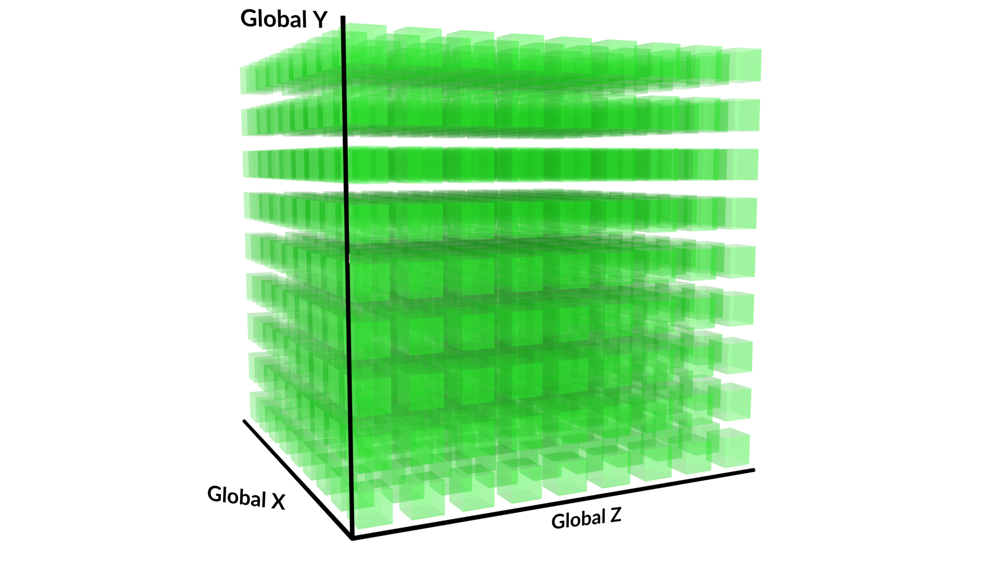
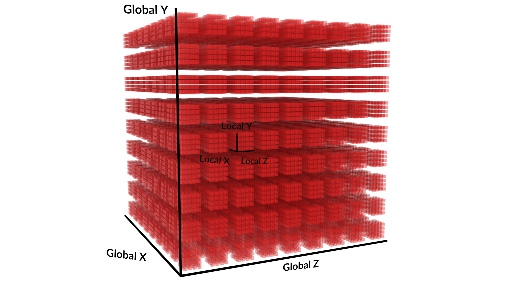
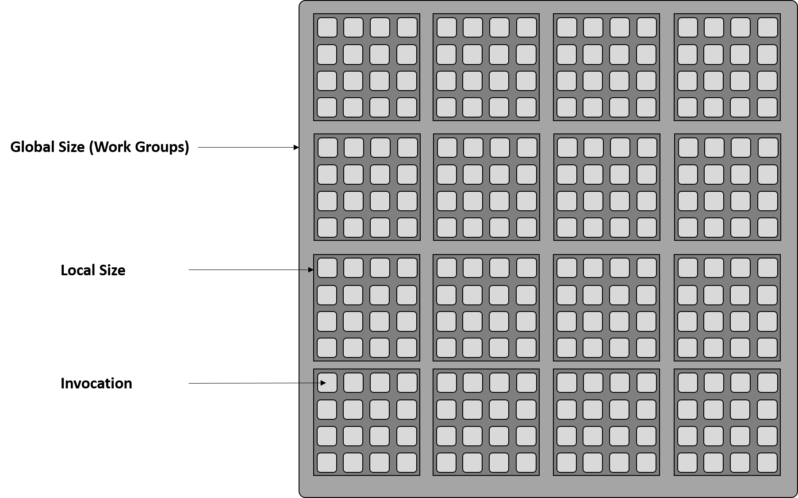
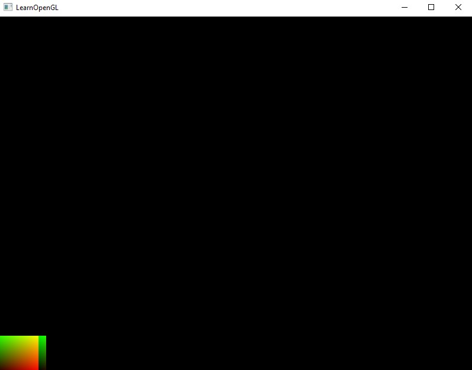

# Compute Shader

## Introduction

### GPGPU

传统上，显卡（GPU）一直是一个用于处理图形渲染的协处理器，但如今越来越多地被用于其他（不一定与图形相关的）计算任务（即图形处理单元上的通用计算，简称GPGPU编程）。  
这种用途变化的主要原因是性能，因为GPU在执行浮点计算时比当今的CPU要快得多。  
然而，这种性能提升也带来了一些编程上的难题。由于GPU不是串行(serial)处理器，而是串流(stream)处理器，因此将为CPU设计的算法编程并运行在GPU上并非易事。[see LearnOpenGL](https://learnopengl.com/Guest-Articles/2022/Compute-Shaders/Introduction#:~:text=Since%20the%20GPU%20is%20not%20a%20serial%20but%20a%20stream%20processor)


image from [GPU Gems](https://developer.nvidia.com/gpugems/gpugems/part-vi-beyond-triangles/chapter-37-toolkit-computation-gpus)

### Stream Program Model on GPU

Stream处理器使用一个函数/kernel内核（例如fragment shader）在一组 input records/stream（例如fragments）上运行，以并行方式生成一组 output records（最终图像的像素）。  
由于并行执行，每个元素都是独立处理的，元素之间没有依赖关系。

如上所述，在GPU上运行的程序最重要（也是强制性）的方面是它们必须能够并行化。共享内存对于在显卡上运行的内核来说并不容易实现，而且非常有限。这意味着内核执行的计算必须彼此独立。
例如，实现一个程序将一个stream中的每个元素与第二个stream中相应的元素（e.g. by index）相乘是很容易的，
而要将一个stream中的所有值累加到一个总和值则要复杂得多（甚至可能无法完全并行实现），因为它始终需要前一次执行的结果。
(尽管这种操作可以通过GPU进行优化，使用内核在并行时累加子stream的数据，并减少大型stream的串行累加量。子stream数据的结果需要在主机程序中进行组合。)

在编写GPU内核时，必须牢记这种强制性的并行性，因为GPU并不适合处理所有问题，这与其stream编程模型有关。

总而言之，compute shader 非常适合许多小型并行 batches。见: [Mythbusters Demo GPU versus CPU](https://www.youtube.com/watch?v=-P28LKWTzrI)

## Compute Shader Stage

为了使GPU计算更容易访问，尤其是在图形应用程序中共享通用内存mappings映射的情况下，OpenGL标准在4.3版本中引入了Compute Shader，作为一个用于计算任意信息的着色器阶段。  
虽然其他GPGPU API（如OpenCL和CUDA）提供了更多功能，适用于大型GPGPU项目，但OpenGL的Compute Shader被故意设计为与其他OpenGL功能结合，
并使用GLSL以便更容易与现有的OpenGL图形管线/应用程序集成。在OpenGL图形应用程序中使用Compute Shader，可以避免如使用OpenCL或CUDA时需要的复杂接口。


Compute Shader是通用着色器，与其他着色器阶段不同，它们不属于图形管线的一部分（详见OpenGL 4.3中的Compute Shaders）。  
Compute Shader本身定义了其操作的数据“空间”。可以使用OpenGL函数来定义执行次数，并启动计算操作的执行。与其他着色器不同，Compute Shader没有用户定义的输入或输出。

要将数据传递给Compute Shader，需要通过例如 texture access, image loads or SSBO 访问来获取数据，并且需要将计算结果显式写入 image 或 SSBO。

下表显示了各个着色器阶段所操作的数据。如表所示，Compute Shader处理的是一个“抽象工作项”。

Stage | Data Element
--- | ---
Vertex Shader | per vertex
Tessellation Control Shader	| per vertex (in a patch)
Tessellation Evaluation Shader | per vertex (in a patch)
Geometry Shader | per primitive
Fragment Shader | per fragment
Compute Shader | per (abstract) "work item"

### Compute Space

可以使用名为 Work Groups (工作组) 的概念来定义Compute Shader的操作空间。工作组是可以执行的最小计算操作单元（从host主机应用程序）。  
虽然工作组的空间是三维的（“X”，“Y”，“Z”），但用户可以将任一维度设置为1，以在一维或二维空间中执行计算。  
在下图中，每个绿色立方体表示一个工作组：


image from [LearnOpenGL](https://learnopengl.com/Guest-Articles/2022/Compute-Shaders/Introduction)

在执行工作组时，顺序可能会任意变化，程序不应依赖于各个组的处理顺序。

工作组可能包含多个Compute Shader Invocations(调用)。着色器的 invocations 次数由工作组的 local size (本地大小)定义，而 local size 也是三维的。

下图显示了每个Work Group在其本地空间调用中的分割方式，用红色立方体表示。



::: info 一个示例：
假设Compute Shader的本地大小为(128, 1, 1)，并且以工作组数量(16, 8, 64)执行着色器。
该着色器将被单独调用(invoke) 1,048,576次。这个次数是工作组维度的乘积与Compute Shader本地大小的乘积的结果：(128 * 1 * 1 * 16 * 8 * 64 = 1,048,576)。每个 invocation 都可以通过一组独特的输入进行唯一标识。
:::

虽然在特定 Work Group 中的不同 invocation 之间可以使用 shared variables (共享变量)和特殊函数进行通信，但在不同工作组之间进行通信则不太可能有效，并且可能会导致系统死锁。

## Create your Compute Shader

接下来让我们通过创建一个“Hello-World”程序来实践。这个程序将在Compute Shader中将（颜色）数据写入 image/texture 对象的像素中。  
完成Compute Shader的执行后，它将使用第二个着色器程序显示纹理，该程序使用顶点着色器绘制一个简单的屏幕填充四边形和一个片段着色器。

::: info OpenGL 4.3 Required
由于Compute Shader是在OpenGL 4.3中引入的，需要确保上下文版本大于4.3：
```cpp
glfwWindowHint(GLFW_CONTEXT_VERSION_MAJOR, 4);
glfwWindowHint(GLFW_CONTEXT_VERSION_MINOR, 3);
```
:::


### Compile the Compute Shader

创建和编译着色器的代码与其他着色器的代码几乎相同。但由于Compute Shader不绑定到渲染管线的其余部分，我们在创建程序后，仅将着色器附加到使用GL_COMPUTE_SHADER类型的新程序上。

```cpp
unsigned int compute;
// compute shader
compute = glCreateShader(GL_COMPUTE_SHADER);
glShaderSource(compute, 1, &cShaderCode, NULL);
glCompileShader(compute);
checkCompileErrors(compute, "COMPUTE");

// shader Program
ID = glCreateProgram();
glAttachShader(ID, compute);
glLinkProgram(ID);
checkCompileErrors(ID, "PROGRAM");
```

与往常一样，我们首先在着色器的顶部定义版本，并在Compute Shader中定义每个维度的 local incovations size (本地调用大小)。

这可以使用下面代码中的特殊 layout 输入声明来完成。默认情况下，本地大小为1，因此如果您只想要一个1D或2D工作组空间，您可以只指定local_size_x或local_size_x和local_size_y分量。  
为了完整性，我们将显式设置所有分量，如下所示。

```cpp
#version 430 core

layout (local_size_x = 1, local_size_y = 1, local_size_z = 1) in;
```

由于我们将在图像的每个像素上执行着色器，因此我们将在每个维度上保持本地大小为1（每个工作组1个像素）。  
我们稍后会更改此值。OpenGL将在后台处理此本地大小。该值必须是大于0的整型常量表达式，并且必须遵守以下警告段落中显示的限制。

::: warning
单个Compute Shader dispatch call 中可以 dispatched 的工作组数量有限制。
此限制由GL_MAX_COMPUTE_WORK_GROUP_COUNT定义，可以使用glGetIntegeri_v函数查询，其中索引0、1和2分别对应X、Y和Z维度。

本地大小也有限制，可以通过GL_MAX_COMPUTE_WORK_GROUP_SIZE查询，还有一个对工作组内调用总数的限制，即本地大小的X、Y和Z分量的乘积必须小于GL_MAX_COMPUTE_WORK_GROUP_INVOCATIONS。

由于我们自己定义并划分任务和Compute Shader组的大小，我们必须牢记这些限制。
:::

我们将在着色器中绑定一个2D图像作为写入数据的对象。内部格式（此处为`rgba32f`）需要与host(主机)程序中的纹理格式相同。

```glsl
layout(rgba32f, binding = 0) uniform image2D imgOutput;
```

我们必须使用`image2D`，因为它表示 texture (纹理)中的单个 image (图像)。虽然采样器变量使用整个纹理，包括mipmap levels 和 array layers，但 image 仅包含 texture 中的单个 image。  
注意，尽管大多数纹理采样函数使用归一化的纹理坐标[0,1]，但对于图像，我们需要绝对的 integer texel coordinates (整型纹素坐标)。  
图像和采样器是完全分开的，包括它们的 bindings (绑定)。虽然采样器只能从纹理中读取数据，但图像变量可以读取和/或写入数据。

设置完这些后，我们现在可以在着色器中编写主函数，其中我们将`imgOutput`填充颜色值。  
要确定我们当前在着色器执行中操作的像素，可以使用以下GLSL内置变量。

Type | Built-in name | Description
--- | --- | ---
`uvec3` | `gl_NumWorkGroups` | number of work groups that have been dispatched. set by `glDispatchCompute()`
`uvec3` | `gl_WorkGroupSize` | size of the work group (local size) operated on. defined with `layout`
`uvec3` | `gl_WorkGroupID` | index of the work group currently being operated on
`uvec3` | `gl_LocalInvocationID` | index of the current work item in the work group
`uvec3` | `gl_GlobalInvocationID` | global index of the current work item <br>(`gl_WorkGroupID * gl_WorkGroupSize + gl_LocalInvocationID`)
`uint` | `gl_LocalInvocationIndex` | 1d index representation of `gl_LocalInvocationID`. <br>(`gl_LocalInvocationID.z * gl_WorkGroupSize.x * gl_WorkGroupSize.y + gl_LocalInvocationID.y * gl_WorkGroupSize.x + gl_LocalInvocationID.x`)

使用上表中的内置变量，我们将在图像上创建一个简单的颜色渐变（st-map）。

```glsl
void main() {
    vec4 value = vec4(0.0, 0.0, 0.0, 1.0);
    ivec2 texelCoord = ivec2(gl_GlobalInvocationID.xy);
	
    value.x = float(texelCoord.x)/(gl_NumWorkGroups.x);
    value.y = float(texelCoord.y)/(gl_NumWorkGroups.y);
	
    imageStore(imgOutput, texelCoord, value);
}
```

我们将设置Compute Shader的执行，每个 invocation 对应一个像素，因此全局的x和y尺寸将等于图像的x和y维度。  
因此，gl_GlobalInvocationID为我们提供了当前像素的绝对坐标。  
注意，由于我们将所有本地尺寸设置为1，因此每个工作组只有一个调用。使用gl_NumWorkGroups变量，我们可以计算图像在每个维度范围[0, 1]内的相对坐标。

然后我们可以使用`imageStore`函数将计算出的像素数据写入图像中。`imageStore`函数的第一个参数是要写入的 image unit (图像单元)，
第二个参数是 absolute texel coordinate (绝对的纹素坐标)，
第三个参数是要存储在此texel(纹素)处的数据值。

### Create the Image Object

在host程序中，我们现在可以创建实际的图像以进行写入。我们将创建一个512x512像素的纹理。

```cpp
// texture size
const unsigned int TEXTURE_WIDTH = 512, TEXTURE_HEIGHT = 512;
...
unsigned int texture;

glGenTextures(1, &texture);
glActiveTexture(GL_TEXTURE0);
glBindTexture(GL_TEXTURE_2D, texture);
glTexParameteri(GL_TEXTURE_2D, GL_TEXTURE_WRAP_S, GL_CLAMP_TO_EDGE);
glTexParameteri(GL_TEXTURE_2D, GL_TEXTURE_WRAP_T, GL_CLAMP_TO_EDGE);
glTexParameteri(GL_TEXTURE_2D, GL_TEXTURE_MAG_FILTER, GL_LINEAR);
glTexParameteri(GL_TEXTURE_2D, GL_TEXTURE_MIN_FILTER, GL_LINEAR);
glTexImage2D(GL_TEXTURE_2D, 0, GL_RGBA32F, TEXTURE_WIDTH, TEXTURE_HEIGHT, 0, GL_RGBA, 
             GL_FLOAT, NULL);

glBindImageTexture(0, texture, 0, GL_FALSE, 0, GL_READ, GL_RGBA32F);
```

这里使用`glBindImageTexture`函数将纹理的特定级别绑定到图像单元。由于我们使用`image2D`，我们需要使用此函数而不是`glBindTexture`函数。  
请注意，我们使用`GL_RGBA32F`作为内部格式，以对应Compute Shader中使用的布局格式。

### Executing the Compute Shader

设置完这些后，我们现在终于可以执行Compute Shader了。在绘制循环中，我们可以使用并绑定我们的Compute Shader，并使用`glDispatchCompute`函数执行它。

```cpp
// render loop
// -----------

glUseProgram(computeShaderProgram);
glDispatchCompute((unsigned int)TEXTURE_WIDTH, (unsigned int)TEXTURE_HEIGHT, 1);

// make sure writing to image has finished before read
glMemoryBarrier(GL_SHADER_IMAGE_ACCESS_BARRIER_BIT);
```

我们首先使用 `glUseProgram` 函数绑定着色器。`glDispatchCompute`函数根据给定的三个维度参数启动一个或多个计算工作组。  
这里我们启动二维执行对应图像的尺寸，第三个分量保持为1。  
虽然工作组内的各个着色器 invocations 作为一个单元执行，但工作组是完全独立并且以不确定的顺序执行的。

在Compute Shader执行后访问图像数据之前，我们需要定义一个 Barrier，确保数据写入完全完成。`glMemoryBarrier`定义了一个这样的 Barrier，用于排序内存 transactions。  
参数 `GLbitfield barriers` 指定了要插入的 Barriers，它们必须是任何GL barrier_bit常量的按位组合（see [glMemoryBarrier - Khronos](https://www.khronos.org/registry/OpenGL-Refpages/gl4/html/glMemoryBarrier.xhtml)）。  
在这种情况下，我们只需要`GL_SHADER_IMAGE_ACCESS_BARRIER_BIT`，以确保使用 image functions 的访问将反映在障碍之前由着色器写入的数据。

::: info
也可以使用`GL_ALL_BARRIER_BITS`来为所有类型的写入设置通用障碍。
:::

::: warning
`glMemoryBarrier`函数将在此点停止主程序的执行，因此最好在访问障碍数据之前插入此函数。
:::

### Rendering the image

最后，我们将渲染一个矩形并在片段着色器中应用纹理。

```cpp
// render image to quad
glClear(GL_COLOR_BUFFER_BIT | GL_DEPTH_BUFFER_BIT);
screenQuad.use();
screenQuad.setInt("tex", 0);
glActiveTexture(GL_TEXTURE0);
glBindTexture(GL_TEXTURE_2D, texture);
renderQuad();
```

我们现在将纹理绑定为`sampler2D`并使用矩形的纹理坐标进行采样。

顶点和片段着色器非常简单，如下所示。

Vertex Shader:
```glsl
#version 430 core
layout (location = 0) in vec3 aPos;
layout (location = 1) in vec2 aTexCoords;
	
out vec2 TexCoords;
	
void main()
{
    TexCoords = aTexCoords;
    gl_Position = vec4(aPos, 1.0);
}
```

Fragment Shader:
```glsl
#version 430 core
out vec4 FragColor;
	
in vec2 TexCoords;
	
uniform sampler2D tex;
	
void main()
{             
    vec3 texCol = texture(tex, TexCoords).rgb;      
    FragColor = vec4(texCol, 1.0);
}
```

Image Output:


## Adding Time Variable and Speed Measuring

我们现在将时间加入程序中，以进行性能测量，从而测试哪种设置（work group amount/local size）最适合我们。

```cpp
// timing 
float deltaTime = 0.0f;     // time between current frame and last frame
float lastFrameTime = 0.0f; // time of last frame
int fCounter = 0;

// render loop
// -----------
...
// Set frame time
float currentFrameTime = glfwGetTime();
deltaTime = currentFrame - lastFrameTime;
lastFrameTime = currentFrameTime;
if (fCounter > 500) {
    std::cout << "FPS: " << 1 / deltaTime << std::endl;
    fCounter = 0;
} else {
    fCounter++;
}		
```

上面的代码每500帧打印一次帧率，因为过于频繁的打印会减慢程序速度。  
当我们使用这个“秒表”运行程序时，会发现帧率永远不会超过60帧/秒，因为GLFW默认将刷新率锁定为60fps。

为了绕过这个锁定，我们可以将当前OpenGL上下文的交换间隔设置为0，以获得超过60fps的刷新率。我们可以在初始化GLFW上下文时使用`glfwSwapInterval`函数来实现这一点：

```cpp
glfwMakeContextCurrent(window);
glfwSetFramebufferSizeCallback(window, framebuffer_size_callback);
glfwSwapInterval(0);
```

现在，我们获得更多的帧率。不过需要说明的是，这个示例/Hello World程序非常简单，实际上并没有任何复杂的计算，因此计算时间非常短。

接下来，我们可以使用时间变量使纹理动画化（从左向右移动）。首先，我们修改Compute Shader使其具有动画效果：

```glsl
#version 430 core

layout (local_size_x = 1, local_size_y = 1, local_size_z = 1) in;
	
// images 
layout(rgba32f, binding = 0) uniform image2D imgOutput;

// variables
layout (location = 0) uniform float t;                 /** Time */
	
void main() {
    vec4 value = vec4(0.0, 0.0, 0.0, 1.0);
    ivec2 texelCoord = ivec2(gl_GlobalInvocationID.xy);
    float speed = 100;
    // the width of the texture
    float width = 1000;

    value.x = mod(float(texelCoord.x) + t * speed, width) / (gl_NumWorkGroups.x);
    value.y = float(texelCoord.y)/(gl_NumWorkGroups.y);
    imageStore(imgOutput, texelCoord, value);
}
```

我们创建了一个名为`t`的uniform变量，用于保存当前时间。  
为了使纹理从左向右滚动，我们可以使用取模操作`%`。我们通过将时间变量`t`乘以一个速度值来作为`x`坐标的偏移量，从而实现动画效果。  
对于偏移后的x坐标，我们可以使用纹理的宽度（在此例中为硬编码的）作为除数，以获得新的坐标。  
我们将这个值除以x方向的工作组大小，得到0到1之间的比例值。同样地，对于y值，我们只需将纹素坐标除以y方向的工作组数量。

在主host程序中，我们可以通过`glUniform`函数为变量赋值，就像为任何其他着色器变量赋值一样。

```cpp
glUseProgram(computeShaderProgram);
glUniform1f(glGetUniformLocation(computeShaderProgram, "t"), currentFrameTime);
```

由于`currentFrameTime`是一个不断变化的值，我们必须在渲染循环中的每次迭代中进行赋值。

::: info 
<!-- 通常来说，在浮点变量前面的layout (location = 0)定义并不是必须的，因为着色器实现会在每次uniform赋值时查询每个变量的位置。  
如果在每个渲染循环中对多个变量执行此操作，可能会降低程序执行速度。 -->

如果你确定 uniform location 不会改变，并且想尽可能提高程序的性能，可以在渲染循环之前查询 location 并将其保存在host主程序中。
```cpp
// glUniform1f(glGetUniformLocation(programId, name.c_str()), value);
glUniform1f(program->GetCachedLocation(name.c_str()), value);
```
:::


## Altering local size

最后，我们可以利用本地大小。正如下图所示，N维执行的总量是工作组数量与本地调用次数的乘积（参见上面的计算空间部分）。
目前，我们将所有维度的本地大小设置为1，因此一个像素对应一个工作组（深灰色方块）。

在最后这部分中，我们将为每个工作组添加一些本地调用（小的浅灰色方块）。  
换句话说，我们将图像分成特定大小的batches(批次)，每个工作组处理这些批次。因此，我们需要稍微调整我们的着色器，以便正确计算和写入相应的纹素。  
可以想象，最终的图像就像覆盖在下面的工作组表上，其中每个调用将对应图像中的一个像素：



为简单起见，我们增加了纹理的分辨率，以得到一个可以被10整除的数字。在这里，我们将有1,000,000个像素，因此需要100万次着色器 invocations。

```cpp
// texture size
const unsigned int TEXTURE_WIDTH = 1000, TEXTURE_HEIGHT = 1000;
```

我们现在可以将工作组的调度数量按每个维度的10倍比率减少。这意味着我们将执行10,000个工作组。

```cpp
glDispatchCompute((unsigned int)TEXTURE_WIDTH/10, (unsigned int)TEXTURE_HEIGHT/10, 1);
```

如果在不修改着色器的情况下运行程序，我们会发现只有1/100的图像被计算出来。



要重新计算整个图像，我们必须相应地调整计算着色器的`local_size`。  
在这里，我们将 invocations 分布在X和Y两个维度上。

```glsl
#version 430 core
layout (local_size_x = 10, local_size_y = 10, local_size_z = 1) in;

layout(rgba32f, binding = 0) uniform image2D imgOutput;

layout (location = 0) uniform float t;                 /** Time */

void main() {
    vec4 value = vec4(0.0, 0.0, 0.0, 1.0);
    ivec2 texelCoord = ivec2(gl_GlobalInvocationID.xy);
    
    float speed = 100;
    // the width of the texture
    float width = 1000;

    value.x = mod(float(texelCoord.x) + t * speed, width) / (gl_NumWorkGroups.x * gl_WorkGroupSize.x);
    value.y = float(texelCoord.y)/(gl_NumWorkGroups.y*gl_WorkGroupSize.y);
    imageStore(imgOutput, texelCoord, value);
}
```

如上所示，我们需要调整相对纹素坐标计算的比例。`gl_NumWorkGroups`变量为我们提供了每个工作组的本地大小数量。
如之前所述，维度的数量是工作组数量与本地调用数量的乘积。


source code for this demo [here](https://learnopengl.com/code_viewer_gh.php?code=src/8.guest/2022/5.computeshader_helloworld/compute_shader_hello_world.cpp).

## Final words

这是对compute shader及其工作原理的一个简单概述。由于计算着色器不属于渲染管线的一部分，因此调试无法正常工作的着色器或程序可能会变得更加复杂。  
本次实现展示了使用图像访问来操作数据的方式之一。使用 UBO 或 SSBO 是更常见的操作几何体的方法，比如粒子或布料模拟。

<!-- 在接下来的文章中，我们将深入探讨如何创建粒子模拟，并处理缓冲对象以在数据操作后处理输入数据和输出数据。
同时，我们还将了解共享内存和原子操作。后续的文章将基于这些基础知识，深入计算着色器以及更复杂的计算，如模拟或图像处理。 -->


## Resources

- [LearnOpenGL - Compute Shader Introduction by Jonas Sorgenfrei](https://learnopengl.com/Guest-Articles/2022/Compute-Shaders/Introduction)
- [Simple Raytracer with Compute Shaders](https://antongerdelan.net/opengl/compute.html)
- [GPU Gems - A Toolkit for Computation on GPUs](https://developer.nvidia.com/gpugems/gpugems/part-vi-beyond-triangles/chapter-37-toolkit-computation-gpus)
- https://alain.xyz/blog/gpgpu-compute-concepts
- https://medium.com/@daniel.coady/compute-shaders-in-opengl-4-3-d1c741998c03


<style>

img {
    max-width: min(100%, 860px);
}

</style>