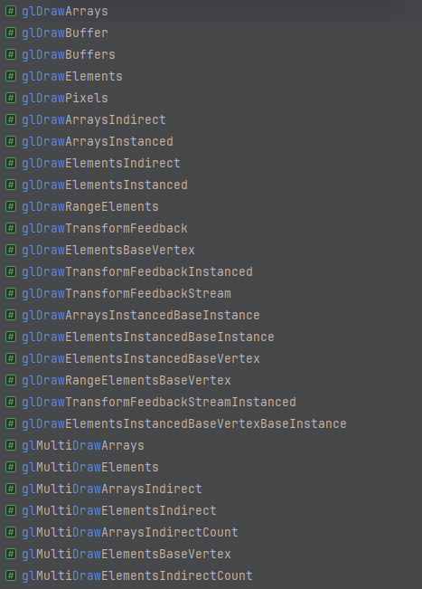
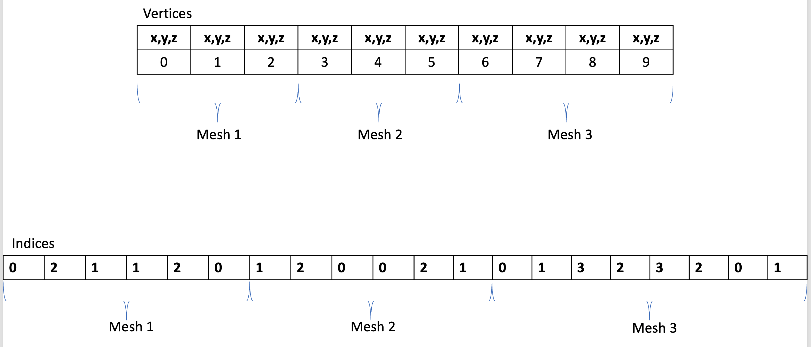

# OpenGL (4.6) 中的所有 Draw Functions


## Overview

截止目前(2024)最新的 OpenGL 4.6 (2017)，共有这些DrawCall函数:

::: details ALL DRAW FUNCTIONS

P.S. glDrawBuffer(s) 不算，那是设置 RenderTarget 的
:::

他们可以被分为 

1. ***(Basic) Draw***: 绘制单个   
  `glDraw<Arrays/Elements>`..
2. ***MultiDraw***: 一次调用 绘制多个(foreach-like)，避免状态切换/验证的开销    
  `glMultiDraw<Arrays/Elements>[Indirect|IndirectCount]`..
3. ***Instanced Draw***: 批量"重复"渲染 但引入gl_InstanceID或Instance VertexAttribute  
  `glDraw<Arrays/Elements>Instanced[BaseInstance]`..
4. ***Indirect Draw***: 数据来自GPU, 允许GPU动态生成绘制命令  
  `gl[Multi]Draw<Arrays/Elements>Indirect[Count]`..
5. ***BaseVertex, BaseInstance***: baseVertex是EBO索引**值**的偏移量; baseInstance是InstanceArrays的顶点数据偏移量  
  `glDrawElements<BaseVertex/+/BaseInstance>`, `glDrawArraysInstancedBaseInstance`...
6. ***Transform Feedback Draw***: 从Transform Feedback对象中直接绘制。(Transform Feedback特性可捕获Vertex Shader或Geometry Shader的输出，并存储在VBO中)  
  `glDrawTransformFeedback[Stream/+/Instanced]`
7. ***Conditional Rendering***: 条件渲染 仅在满足特定 Query 条件时才渲染  
  `gl<Begin/End>ConditioinalRender`


## I. Basic Draw

APIs:
```cpp
void glDrawArrays(GLenum mode, GLint first, GLsizei count);
void glDrawElements(GLenum mode, GLsizei count, GLenum type, const void * indices);
void glDrawRangeElements(GLenum mode, GLuint start, GLuint end, GLsizei count, GLenum type, const GLvoid * indices);

```

这些是最基本的绘制函数，通常用于渲染单个。


### 1. [glDrawArrays](https://docs.gl/gl4/glDrawArrays)

```cpp
void glDrawArrays(GLenum mode, GLint first, GLsizei count);
```
按照指定的图元类型绘制(如GL_TRIANGLES, GL_POINTS..)，从第first个顶点开始，绘制count个顶点。

**mode**: 图元类型/绘制模式，可以是(下文的首参mode也都一样): GL_POINTS, GL_LINE_STRIP, GL_LINE_LOOP, GL_LINES, GL_LINE_STRIP_ADJACENCY, GL_LINES_ADJACENCY, GL_TRIANGLE_STRIP, GL_TRIANGLE_FAN, GL_TRIANGLES, GL_TRIANGLE_STRIP_ADJACENCY, GL_TRIANGLES_ADJACENCY, and GL_PATCHES

#### 类似
- 类似于vulkan的`void vkCmdDraw(VkCommandBuffer commandBuffer,
uint32_t vertexCount,
uint32_t instanceCount,
uint32_t firstVertex,
uint32_t firstInstance))` (vk instancing draw也是用这个函数)
- 类似于[wgpu](https://docs.rs/wgpu/latest/wgpu/struct.RenderPass.html#method.draw)的
  `pub fn RenderPass::draw(&mut self, vertices: Range<u32>, instances: Range<u32>)`

#### 用例1 - Use VAO, Full MainLoop
```cpp{7}
while(!glfwWindowShouldClose(window)) {
  glClear(GL_COLOR_BUFFER_BIT | GL_DEPTH_BUFFER_BIT);
  glUseProgram(shaderProgramId);
  glBindVertexArray(vao);
  
  // draw points 0-3 from the currently bound VAO with current in-use shader
  glDrawArrays(GL_TRIANGLES, 0, 3);
 
  glfwPollEvents();  // update other window events like input handling 
  glfwSwapBuffers(window);  // put the stuff we've been drawing onto the display
}
```
#### 用例2 - Non VAO
```cpp{5}
glBindBuffer(GL_ARRAY_BUFFER, vboId); // Bind VBO
glEnableVertexAttribArray(0);  // Enable Attribute 
glVertexAttribPointer(0, 3, GL_FLOAT, GL_FALSE, 0, 0); // specifying VertexData layout

glDrawArrays(GL_POINTS, 0, 3); 

glDisableVertexAttribArray(0); 
glBindBuffer(GL_ARRAY_BUFFER, 0); //Unbind
```

### 2. [glDrawElements](https://docs.gl/gl4/glDrawElements)

```cpp
void glDrawElements(GLenum mode, GLsizei count, GLenum type, const void * indices);
```

**type**: EBO索引元素的类型，可以是 GL_UNSIGNED_INT, GL_UNSIGNED_SHORT, GL_UNSIGNED_BYTE  

最后一个参数 `const void* indices`可能有点[令人迷惑](https://stackoverflow.com/questions/21706113/the-4th-argument-in-gldrawelements-is-what), 这分两种情况:
- 你绑定了 GL_ELEMENT_ARRAY_BUFFER E(V)BO: 那么这个 indices 将会作为 GL_ELEMENT_ARRAY_BUFFER (Indices VBO)的 byte offset (本质上是个int，但传入时要转成pointer)  
  所以0或nullptr就是无偏移，如果4且你的index type是GL_UNSIGNED_INT (u32), 那么就偏移1个index
- 如果你没绑定 GL_ELEMENT_ARRAY_BUFFER (且VAO也没这EBO), 那么这个参数就是个指向索引数据内存的指针 (而不是像上面那样一个int数值 假扮的指针)

##### 类似
- vulkan `void vkCmdDrawIndexed(
VkCommandBuffer                             commandBuffer,
uint32_t                                    indexCount,
uint32_t                                    instanceCount,
uint32_t                                    firstIndex,
int32_t                                     vertexOffset,
uint32_t                                    firstInstance);`
- wgpu `pub fn RenderPass::draw_indexed(
&mut self,
indices: Range<u32>,
base_vertex: i32,
instances: Range<u32>,
)`

#### 用例1 - Use VAO:
```cpp{4}
glUseProgram(shaderProgramId);
glBindVertexArray(vao);

glDrawElements(GL_TRIANGLES, 6, GL_UNSIGNED_INT, 0);
```

#### 用例2 - Non VAO:
```cpp{25}
glBindBuffer(GL_ARRAY_BUFFER, vertex_buffer); // vertex_buffer is retrieved from glGenBuffers
glBindBuffer(GL_ELEMENT_ARRAY_BUFFER, index_buffer); // index_buffer is retrieved from glGenBuffers

glEnableVertexAttribArray(texcoord_attrib_index); // Attribute indexes were received from calls to glGetAttribLocation, or passed into glBindAttribLocation.
glEnableVertexAttribArray(normal_attrib_index);
glEnableVertexAttribArray(position_attrib_index);

// vertex_stride is the size of bytes of each vertex in the buffer object
// vertex_position_offset and kin are the offset in bytes of the position data
// in each vertex. For example if your vertex structure is
// [ position, texcoord, normal ] then position vertex_position_offset will
// have offset 0, vertex_texcoord_offset is 12 (position is 3 * sizeof(float)
// bytes large, and texcoord comes just after) and vertex_normal_offset is
// 20 = 5 * sizeof(float).
GLintptr vertex_texcoord_offset = 3 * sizeof(float);
GLintptr vertex_normal_offset = 5 * sizeof(float);
GLintptr vertex_position_offset = 0 * sizeof(float);

glVertexAttribPointer(texcoord_attrib_index, 2, GL_FLOAT, false, vertex_stride, (GLvoid*)vertex_texcoord_offset);
glVertexAttribPointer(normal_attrib_index, 3, GL_FLOAT, false, vertex_stride, (GLvoid*)vertex_normal_offset);
glVertexAttribPointer(position_attrib_index, 3, GL_FLOAT, false, vertex_stride, (GLvoid*)vertex_position_offset);

// num_vertices is the number of verts in your vertex_data.
// index_data is an array of unsigned int offsets into vertex_data.
glDrawElements(GL_TRIANGLES, num_vertices, GL_UNSIGNED_INT, NULL);

```


#### 实现隐喻
```cpp
GLvoid *elementArray;

void glDrawElements(GLenum type, GLint count, GLenum type, GLsizeiptr indices) {
    GLtype *ourElementArray = (type*)((GLbyte *)elementArray + indices);
    
    for(GLint elementIndex = 0; elementIndex < count; elementIndex++) {
        GLint element = ourElementArray[elementIndex];
        VertexShader(positionAttribArray[element], colorAttribArray[element]);
    }
}
```
from [arcsynthesis](https://web.archive.org/web/20150225192608/http://www.arcsynthesis.org/gltut/Positioning/Tutorial%2005.html#:~:text=Example%C2%A05.2.%C2%A0Draw%20Elements%20Implementation)

### 2.1 [glDrawRangeElements](https://docs.gl/gl4/glDrawRangeElements)

```cpp
void glDrawRangeElements(GLenum mode, GLuint start, GLuint end, GLsizei count, GLenum type, const GLvoid * indices);
```
(没啥用) 这是`glDrawElements`的一个变种。注意这个 start/end 指定的Range(indices subset) 是最小和最大的的index **value**而不是index **index**。  
比如我有个EBO只包含3个元素 [200, 201, 202]. 此时我为了渲染这3个元素 应该这样用: `glDrawElements(mode, 200, 202, 3, type, data)`  
所以end-start并不等于count，(int)indices也并不等于start。

::: details 见讨论

https://stackoverflow.com/questions/7549991/questions-about-gldrawrangeelements

Are these two equivalent: glDrawElements(mode, end-start, type, data + start) and glDrawRangeElements(mode, start, end, end-start, type, data)?

From the answer provided and the docs, it sounds like those are equivalently in that both are wrong. If you have an index buffer with 3 elements in it, and the index values contained in the index buffer are 200, 201, and 202, a proper call would look like: glDrawElements(mode, 200, 202, 3, type, data); It could also look like this: glDrawElements(mode, 100, 500, 3, type, data);, but it cannot look like this: glDrawElements(mode, 0, 2, 3, type, data); or glDrawElements(mode, 0, 3, 3, type, data); because the actual values are not between 0 and 2 (or 3).

I realized the "Range" in the name "glDrawRangeElements" bears the same meaning as in "Range Query" --- that is to find a subset of values that fall in the range, not the subset of indices that fall in the range !
:::

##### Example1: 
```cpp
glDrawRangeElements(GL_TRIANGLES, 400, 452, 29, GL_UNSIGNED_BYTE, NULL);
```

### 3. [glDrawPixels](https://registry.khronos.org/OpenGL-Refpages/gl2.1/xhtml/glDrawPixels.xml)

```cpp
void glDrawPixels(GLsizei width, GLsizei height, GLenum format, GLenum type, const void * data);
```
write a block of pixels to the frame buffer


```cpp
GLubyte* PixelBuffer = new GLubyte[WIDTH * HEIGHT * 3];
...
glDrawPixels(WIDTH, HEIGHT, GL_RGB, GL_UNSIGNED_BYTE, PixelBuffer);
```


## II. Multi Draw

APIs:
- glMultiDrawArrays(Indirect|IndirectCount)
- glMultiDrawElements(Indirect|IndirectCount|BaseVertex)
> MultiDraw 不交集 Instanced, 但交集 Indirect *2, IndirectCount *2, BaseVertex *1
```cpp
void glMultiDrawArrays(GLenum mode, const GLint * first, const GLsizei * count, GLsizei drawcount); 
void glMultiDrawElements(GLenum mode, const GLsizei * count, GLenum type, const void * const * indices, GLsizei drawcount);
void glMultiDrawArraysIndirect(GLenum mode, const void *indirect, GLsizei drawcount, GLsizei stride);
void glMultiDrawElementsIndirect(GLenum mode, GLenum type, const void *indirect, GLsizei drawcount, GLsizei stride);
void glMultiDrawArraysIndirectCount(GLenum mode, const void *indirect, GLintptr drawcount, GLsizei maxdrawcount, GLsizei stride);
void glMultiDrawElementsIndirectCount(GLenum mode, GLenum type, const void *indirect, GLintptr drawcount, GLsizei maxdrawcount, GLsizei stride);
```

### MultiDraw的用途 目的 意义是什么？  
"只是"为了更好的性能 减少API调用 减少状态切换，而不是为了更多的功能。它在功能性上 等同于for each多次调用Draw，如下：
```cpp
void glMultiDrawArrays(GLenum mode, const GLint * first, const GLsizei * count, GLsizei drawcount); 
void glMultiDrawElements(GLenum mode, const GLsizei * count, GLenum type, const void * const * indices, GLsizei drawcount);

// 相当于
void glMultiDrawArrays(GLenum mode, const GLint * first, const GLsizei * count, GLsizei drawcount) {
    for (int i = 0; i < drawcount; ++i) {
        if (count[i] > 0)
            glDrawArrays(mode, fisrt[i], count[i]);
    }       
}
void glMultiDrawElements(GLenum mode, const GLsizei * count, GLenum type, const void * const * indices, GLsizei drawcount) {
    for (int i = 0; i < drawcount; ++i) {
        if (count[i] > 0)
            glDrawArrays(mode, count[i], type, indices[i]);
    }       
}
```
也就是并没有提供更多功能，而是为了性能。

### MultiDraw 如何提升性能

一次性绘制多个(相同VAO 但不同顶点数据"范围"的)对象，

减少OpenGL函数调用/验证/状态切换的开销：通过仅进行一次绘制调用，驱动程序（理论上）只需执行一次设置和验证，而不是每次绘制调用执行一次。
甚至可能优化数据传输 指令编码。

不过上面都是“理论上”，因为在实践中，它的性能将取决于驱动程序如何实现它。一些驱动程序可能完全在软件中实现它，并将其视为单个 glDrawArrays 调用的循环。其他人可能能够采用更快的路径。OpenGL 对此不作任何承诺。


 
#### 用例

```cpp{22}
// 定义顶点数据
GLfloat vertices[] = {
    // First Object (Triangle)
    -0.5f, 0.0f, 0.0f,
     0.0f, 0.5f, 0.0f,
     0.5f, 0.0f, 0.0f,
    // Second Object (Triangle)
    -0.75f, -0.5f, 0.0f,
     0.0f, -0.75f, 0.0f,
     0.75f, -0.5f, 0.0f
};

// 假设已经设置好 VAO 和 VBO

// MultiDrawArrays 参数设置
GLint first[] = { 0, 3 };
GLsizei count[] = { 3, 3 };

// 使用 glMultiDrawArrays 绘制两个独立的三角形
glMultiDrawArrays(GL_TRIANGLES, first, count, 2);
```


## III. Instanced Draw

APIs:
- glDrawArraysInstanced(BaseInstance)
- glDrawElementsInstanced(BaseVertex)(+)(BaseInstance)
- glDrawTransformFeedback(Stream)Instanced

```cpp
void glDrawArraysInstanced(GLenum mode, GLint first, GLsizei count, GLsizei primcount);
void glDrawElementsInstanced(GLenum mode, GLsizei count, GLenum type, const void * indices, GLsizei instancecount);
void glDrawArraysInstancedBaseInstance(GLenum mode, GLint first, GLsizei count, GLsizei instancecount, GLuint baseinstance);
void glDrawElementsInstancedBaseInstance(GLenum mode, GLsizei count, GLenum type, const void *indices, GLsizei instancecount, GLuint baseinstance);
void glDrawElementsInstancedBaseVertexBaseInstance(GLenum mode, GLsizei count, GLenum type, void *indices, GLsizei instancecount, GLint basevertex, GLuint baseinstance);
```

如果你要绘制大量相同顶点数据、材质(Shader)的物体 - 比如大量小行星 粒子效果，那么Instancing将是一个很好的选择。  
附：性能差距视频

网上有许多优秀的讲OpenGL Instancing的文章，比如
[LearnOpenGL - Instancing](https://learnopengl.com/Advanced-OpenGL/Instancing), [ThinMatrix - Instancing](https://www.youtube.com/watch?v=Rm-By2NJsrc)。
但这里也总结概括一下，


### 方法1 - Instance Arrays (VBO VertexAttribute)

Host (C++):
```cpp
unsigned int instanceVBO;
glGenBuffers(1, &instanceVBO);
glBindBuffer(GL_ARRAY_BUFFER, instanceVBO);
glBufferData(GL_ARRAY_BUFFER, sizeof(glm::vec2) * 100, &translations[0], GL_STATIC_DRAW);
glBindBuffer(GL_ARRAY_BUFFER, 0); 

glEnableVertexAttribArray(2);
glBindBuffer(GL_ARRAY_BUFFER, instanceVBO);
glVertexAttribPointer(2, 2, GL_FLOAT, GL_FALSE, 2 * sizeof(float), (void*)0);
glBindBuffer(GL_ARRAY_BUFFER, 0);	
glVertexAttribDivisor(2, 1);  // IMPORTANT! set vertex-attribute-2 with attribute-divisor 1. 2=update every 2 instances 

glDrawArraysInstanced(GL_TRIANGLES, 0, 6, 100);  
```

Shader (GLSL): 
```glsl
layout (location = 2) in vec3 instancePos;
```

### 方法2 - Uniform + gl_InstanceID
缺点: 不推荐超过100个(如300个可能会崩溃或慢)，因为uniform数据内存很有限。
然而instancing渲染上万个都有可能，因此这种方法是比较有限制的。

Host (C++):
```cpp
shader.use();
for(unsigned int i = 0; i < 100; i++)
{
    shader.setVec2(("instancePos[" + std::to_string(i) + "]")), translations[i]);
}  

glBindVertexArray(quadVAO);
glDrawArraysInstanced(GL_TRIANGLES, 0, 6, 100);  
```

Shader (GLSL):
```glsl
uniform vec3 instancePos[100];
...
vec3 pos = instancePos[gl_InstanceID];
```


## IV. Indirect Draw

APIs:
```cpp
// Since GL 4.0
void glDrawArraysIndirect(GLenum mode, const void *indirect);
void glDrawElementsIndirect(GLenum mode, GLenum type, const void *indirect);
// MultiDraw Indirect, Since GL 4.3 or ARB_multi_draw_indirect Extension Enabled.
void glMultiDrawArraysIndirect(GLenum mode, const void *indirect, GLsizei drawcount, GLsizei stride);
void glMultiDrawElementsIndirect(GLenum mode, GLenum type, const void *indirect, GLsizei drawcount, GLsizei stride);
void glMultiDrawArraysIndirectCount(GLenum mode, const void *indirect, GLintptr drawcount, GLsizei maxdrawcount, GLsizei stride);
void glMultiDrawElementsIndirectCount(GLenum mode, GLenum type, const void *indirect, GLintptr drawcount, GLsizei maxdrawcount, GLsizei stride);
```

Indirect Draw 允许你将绘制命令的参数（如顶点数量、实例数量等）存储在GPU内存中， 并由GPU直接读取这些参数进行绘制，而不是通过CPU传递。
直接渲染GPU中的数据，省去GPU->CPU->GPU的拷贝过程。

运行时数据来源可能是Compute Shader，也可能是Geometry Shader + Transform Feedback，甚至可能是OpenCL/CUDA。

这种方法不仅减少了CPU与GPU之间的数据传输，还允许GPU动态生成或修改绘制命令，提高了绘制的灵活性和性能。

用途：
- 减少CPU开销: Indirect Draw减少了CPU向GPU传递绘制参数的次数，降低了API调用的频率，适合大量绘制调用的场景。
- 动态绘制: 绘制参数可以由GPU计算生成，适合需要动态调整绘制内容的场景，例如在计算着色器中生成绘制命令。
- 批量绘制: 可以通过一个调用绘制多个对象，而不需要频繁切换上下文。

https://stackoverflow.com/questions/19534284/what-are-the-advantage-of-using-indirect-rendering-in-opengl

### Compute Shader 是必要的吗?

Compute Shader 并不是必须的，但如果你希望在 GPU 上动态生成或更新 Draw Indirect 的参数（例如用 Compute Shader 生成绘制命令），那么就需要使用 Compute Shader。

Draw Indirect 本身 并不依赖于 Compute Shader，但它们可以结合使用，特别是当你需要 GPU 端动态生成或修改绘制命令时。


### Draw Indirect

#### 1. [glDrawArraysIndirect](https://docs.gl/gl4/glDrawArraysIndirect)

glDrawArraysIndirect 的功能类似于 [glDrawArraysInstancedBaseInstance](https://docs.gl/gl4/glDrawArraysInstancedBaseInstance) - 除了其绘制参数是在GPU上的 (GL_DRAW_INDIRECT_BUFFER VBO) 或者你也可以用CPU内存的结构体传入 indirect 参数

```cpp
struct DrawArraysIndirectCommand {
    uint  count;
    uint  instanceCount;
    uint  first;
    uint  baseInstance;
};

const DrawArraysIndirectCommand *cmd = (const DrawArraysIndirectCommand *)indirect;
glDrawArraysInstancedBaseInstance(mode, cmd->first, cmd->count, cmd->instanceCount, cmd->baseInstance);
```

参数 indirect: 如果届时 GL_DRAW_INDIRECT_BUFFER 已被绑定，那么 indirect 将会被解释为一个偏移量 (in bytes?) 对于那块 GPU 内存 (GL_DRAW_INDIRECT_BUFFER VBO)。否则你可以传个CPU内存的结构体进去。(但不推荐 那就缺失MDI最关键的CS功能了)

##### 用例1 - No ComputeShader, indirect = VBO:
不太推荐，这似乎并没有啥功能或性能提升。或许还不如直接调 glDrawArraysInstancedBaseInstance?

```cpp
// 定义绘制参数结构体
struct DrawArraysIndirectCommand {
    GLuint count;           // 顶点数量
    GLuint instanceCount;   // 实例数量
    GLuint first;           // 起始顶点索引
    GLuint baseInstance;    // 基础实例索引
};

// 顶点数据
GLfloat vertices[] = {
  -0.5f, -0.5f, 0.0f,
   0.5f, -0.5f, 0.0f,
   0.0f,  0.5f, 0.0f
};
// ... 创建VAO和VBO

// 设置间接绘制命令
DrawArraysIndirectCommand drawCommand;
drawCommand.count = 3;          // 绘制3个顶点
drawCommand.instanceCount = 1;  // 实例数量为1
drawCommand.first = 0;          // 从第0个顶点开始
drawCommand.baseInstance = 0;   // 基础实例为0

// 创建和绑定一个缓冲区来存储间接绘制命令
GLuint indirectBuffer;
glGenBuffers(1, &indirectBuffer);
glBindBuffer(GL_DRAW_INDIRECT_BUFFER, indirectBuffer);
glBufferData(GL_DRAW_INDIRECT_BUFFER, sizeof(drawCommand), &drawCommand, GL_STATIC_DRAW);

// 渲染循环
while (!glfwWindowShouldClose(window)) {
  glClear(GL_COLOR_BUFFER_BIT);

  glUseProgram(shaderProgram);
  glBindVertexArray(VAO);
  glBindBuffer(GL_DRAW_INDIRECT_BUFFER, indirectBuffer);
  
  // 使用间接绘制命令进行绘制
  glDrawArraysIndirect(GL_TRIANGLES, NULL);
  
  glfwSwapBuffers(window);
  glfwPollEvents();
}

// 清理资源
glDeleteVertexArrays(1, &VAO);
glDeleteBuffers(1, &VBO);
glDeleteBuffers(1, &indirectBuffer);
glDeleteProgram(shaderProgram);
```


##### 用例2 - With Compute Shader: 
更不推荐。就算有CS，也只是每次call draw一次。那岂不是慢死。就好像开车上下2楼 明明走路可以更快。

```cpp
#include <GL/glew.h>
#include <GLFW/glfw3.h>
#include <iostream>

// 顶点着色器源码
const char* vertexShaderSource = R"(
#version 330 core
layout(location = 0) in vec3 aPos;

void main()
{
    gl_Position = vec4(aPos, 1.0);
}
)";

// 片段着色器源码
const char* fragmentShaderSource = R"(
#version 330 core
out vec4 FragColor;

void main()
{
    FragColor = vec4(1.0, 0.5, 0.2, 1.0);
}
)";

// Compute Shader 源码，生成 Draw Indirect 命令
const char* computeShaderSource = R"(
#version 430 core
struct DrawArraysIndirectCommand {
    uint count;
    uint primCount;
    uint first;
    uint baseInstance;
};

layout(std430, binding = 0) buffer CommandBuffer {
    DrawArraysIndirectCommand command;
};

void main() {
    // 假设有 10 个实例，每个实例绘制一个三角形
    command.count = 3;         // 顶点数
    command.primCount = 1;     // 实例数
    command.first = 0;         // 第一个顶点的偏移量
    command.baseInstance = 0;  // 基本实例ID
}
)";

struct DrawArraysIndirectCommand {
    GLuint count;
    GLuint primCount;
    GLuint first;
    GLuint baseInstance;
};

int main() {
    // 初始化 GLFW
    if (!glfwInit()) {
        std::cerr << "Failed to initialize GLFW" << std::endl;
        return -1;
    }

    // 创建窗口
    GLFWwindow* window = glfwCreateWindow(800, 600, "Draw Indirect Example", nullptr, nullptr);
    if (!window) {
        std::cerr << "Failed to create GLFW window" << std::endl;
        glfwTerminate();
        return -1;
    }

    glfwMakeContextCurrent(window);
    glewExperimental = GL_TRUE;
    if (glewInit() != GLEW_OK) {
        std::cerr << "Failed to initialize GLEW" << std::endl;
        return -1;
    }

    // 编译和链接着色器
    GLuint vertexShader = glCreateShader(GL_VERTEX_SHADER);
    glShaderSource(vertexShader, 1, &vertexShaderSource, nullptr);
    glCompileShader(vertexShader);

    GLuint fragmentShader = glCreateShader(GL_FRAGMENT_SHADER);
    glShaderSource(fragmentShader, 1, &fragmentShaderSource, nullptr);
    glCompileShader(fragmentShader);

    GLuint shaderProgram = glCreateProgram();
    glAttachShader(shaderProgram, vertexShader);
    glAttachShader(shaderProgram, fragmentShader);
    glLinkProgram(shaderProgram);

    glDeleteShader(vertexShader);
    glDeleteShader(fragmentShader);

    // 定义三角形的顶点数据
    GLfloat vertices[] = {
        0.0f,  0.5f, 0.0f,
       -0.5f, -0.5f, 0.0f,
        0.5f, -0.5f, 0.0f,
    };

    GLuint vao, vbo;
    glGenVertexArrays(1, &vao);
    glGenBuffers(1, &vbo);

    glBindVertexArray(vao);

    glBindBuffer(GL_ARRAY_BUFFER, vbo);
    glBufferData(GL_ARRAY_BUFFER, sizeof(vertices), vertices, GL_STATIC_DRAW);

    glVertexAttribPointer(0, 3, GL_FLOAT, GL_FALSE, 3 * sizeof(GLfloat), (GLvoid*)0);
    glEnableVertexAttribArray(0);

    glBindBuffer(GL_ARRAY_BUFFER, 0);
    glBindVertexArray(0);

    // 创建 Draw Indirect Command 缓冲区
    GLuint indirectBuffer;
    glGenBuffers(1, &indirectBuffer);
    glBindBuffer(GL_DRAW_INDIRECT_BUFFER, indirectBuffer);
    glBufferData(GL_DRAW_INDIRECT_BUFFER, sizeof(DrawArraysIndirectCommand), nullptr, GL_DYNAMIC_DRAW);

    // 编译和链接 Compute Shader
    GLuint computeShader = glCreateShader(GL_COMPUTE_SHADER);
    glShaderSource(computeShader, 1, &computeShaderSource, nullptr);
    glCompileShader(computeShader);

    GLuint computeProgram = glCreateProgram();
    glAttachShader(computeProgram, computeShader);
    glLinkProgram(computeProgram);
    glDeleteShader(computeShader);

    // 使用 Compute Shader 生成命令
    glUseProgram(computeProgram);
    glBindBufferBase(GL_SHADER_STORAGE_BUFFER, 0, indirectBuffer);
    glDispatchCompute(1, 1, 1);  // 生成一个命令
    glMemoryBarrier(GL_COMMAND_BARRIER_BIT);  // 保证命令缓冲区可用

    while (!glfwWindowShouldClose(window)) {
        glClear(GL_COLOR_BUFFER_BIT);

        glUseProgram(shaderProgram);

        // 绘制使用 Draw Indirect
        glBindVertexArray(vao);
        glBindBuffer(GL_DRAW_INDIRECT_BUFFER, indirectBuffer);
        glDrawArraysIndirect(GL_TRIANGLES, nullptr);

        // 交换缓冲区
        glfwPollEvents();
        glfwSwapBuffers(window);
    }

    // 清理
    glDeleteBuffers(1, &vbo);
    glDeleteVertexArrays(1, &vao);
    glDeleteBuffers(1, &indirectBuffer);
    glDeleteProgram(shaderProgram);
    glDeleteProgram(computeProgram);

    glfwDestroyWindow(window);
    glfwTerminate();

    return 0;
}
```

#### 2. [glDrawElementsIndirect](https://docs.gl/gl4/glDrawElementsIndirect)

glDrawElementsIndirect 的功能相当于 glDrawElementsInstancedBaseVertexBaseInstance - 除了绘制参数是存在 GPU 上的 (GL_DRAW_INDIRECT_BUFFER  VBO)

```cpp
struct DrawElementsIndirectCommand {
    uint  count;
    uint  instanceCount;
    uint  firstIndex;
    int   baseVertex;
    uint  reservedMustBeZero;
};
// @param indirect will be interpreted as an offset if a buffer is bound to the GL_DRAW_INDIRECT_BUFFER binding at the time of a call to glDrawElementsIndirect.
void glDrawElementsIndirect(GLenum mode, GLenum type, const void * indirect) {
    const DrawElementsIndirectCommand *cmd  = (const DrawElementsIndirectCommand *)indirect;
    glDrawElementsInstancedBaseVertexBaseInstance(mode,
                                                  cmd->count,
                                                  type,
                                                  cmd->firstIndex * size-of-type,
                                                  cmd->primCount,
                                                  cmd->baseVertex,
                                                  cmd->baseInstance);
}
```


### MultiDraw Indirect

[ktstephano](https://ktstephano.github.io/rendering/opengl/mdi), 
[Litasa](https://litasa.github.io/blog/2017/09/04/OpenGL-MultiDrawIndirect-with-Individual-Textures),

这才是 Indirect 真正强大的地方，可以让跑车在高速上跑的地方而不是在楼梯里跑(上面非Multi-Draw的Indirect)的地方。

> MDI opens the door to a totally new approach to generating draw commands which supports parallel command creation (either with multiple CPU cores or even on the GPU) and at the same time reduces the amount of time the CPU has to spend submitting draw calls to the driver. It also allows us to reuse draw commands from previous frames if nothing has changed.
> -- [ktstephano](https://ktstephano.github.io/rendering/opengl/mdi#:~:text=MDI%20opens%20the%20door%20to%20a%20totally%20new%20approach%20to%20generating%20draw%20commands%20which%20supports%20parallel%20command%20creation)

MDI 与其他老方法的主要区别在于，MDI不是手动提交每个绘制调用（实例或非实例、索引或非索引），而是将绘制调用打包到 GPU 缓冲区中，该缓冲区在绘制之前绑定到 GL_DRAW_INDIRECT_BUFFER 目标。
这意味着我们不是连续提交多个绘制命令，而是一次提交当前绑定 GPU 缓冲区中的每个绘制调用。

这就是并行绘制命令生成选项发挥作用的地方。由于在我们绑定并提交绘制命令缓冲区之前，OpenGL 实际上不会对它执行任何操作，因此多个线程可以在我们同步和绘制之前提前将数据写入缓冲区。
渲染线程将始终提交绘制命令，但多个线程可以在此之前写入绘制命令缓冲区。

另一件重要的事情是 GL_DRAW_INDIRECT_BUFFER 由 GPU 内存支持，可以像常规 SSBO 一样使用。这意味着您可以将其传递到计算着色器并让它直接操作绘制命令。 GPU 现在可以生成自己的工作！

Summery:
- Multiple threads or the GPU can write to a draw command buffer
- The rendering thread synchronizes and submits the commands in the buffer with a single API call.

#### APIs 

当涉及到 MDI 时，我们将处理两个函数：
```cpp
void glMultiDrawArraysIndirect(
    GLenum mode,
    const void *indirect,
    GLsizei drawcount,
    GLsizei stride
);

void glMultiDrawElementsIndirect(
    GLenum mode,
    GLenum type,
    const void *indirect,
    GLsizei drawcount,
    GLsizei stride
);
```
它们之间的区别在于，第一个执行 non-indexed multi-draw 非索引多次绘制，而第二个执行 indexed multi-draw 索引多次绘制。

**参数**
- indirect (同上): 如果届时 GL_DRAW_INDIRECT_BUFFER 已被绑定，那么 indirect 将会被解释为一个偏移量 (in bytes?) 对于那块 GPU 内存 (GL_DRAW_INDIRECT_BUFFER VBO)。否则你可以传个CPU内存的结构体进去。(但不推荐 那就缺失MDI最关键的CS功能了)
- drawcount: Number of draw commands in the buffer currently bound to GL_DRAW_INDIRECT_BUFFER.
- stride: 一个绘制命令的结束与下一个绘制命令的开始之间的字节偏移量。如果为 0，则绘图命令缓冲区中的数据是紧密包装的。If greater than 0 then the structure contains extra data that the application plans to use but OpenGL needs to skip over.

::: details "Equivalent"
如果不考虑 ComputeShader 的话，glMultiDraw*Indirect 相当于:
```cpp
// A single call to glMultiDrawArraysIndirect is equivalent, assuming no errors are generated to:
void glMultiDrawArraysIndirect(GLenum mode, const void *indirect, GLsizei drawcount, GLsizei stride) {
    for (GLsizei n = 0; n < drawcount; n++) {
        const DrawArraysIndirectCommand *cmd;
        if (stride != 0) {
            cmd = (const DrawArraysIndirectCommand*)((uintptr)indirect + n * stride);
        } else  {
            cmd = (const DrawArraysIndirectCommand*)indirect + n;
        }

        glDrawArraysInstancedBaseInstance(mode, cmd->first, cmd->count, cmd->instanceCount, cmd->baseInstance);
    }
}
void glMultiDrawElementsIndirect(GLenum mode, GLenum type, const void *indirect, GLsizei drawcount, GLsizei stride) {
    for (GLsizei n = 0; n < drawcount; n++) {
        const DrawElementsIndirectCommand *cmd;
        if (stride != 0) {
            cmd = (const DrawElementsIndirectCommand  *)((uintptr)indirect + n * stride);
        } else {
            cmd = (const DrawElementsIndirectCommand  *)indirect + n;
        }
    
        glDrawElementsInstancedBaseVertexBaseInstance(
            mode,
            cmd->count,
            type,
            cmd->firstIndex * size-of-type,
            cmd->instanceCount,
            cmd->baseVertex,
            cmd->baseInstance);
    }
}
```
单次调用 glMultiDrawArraysIndirect "相当于"多次调用 glDrawArraysInstancedBaseInstance (但后者不能结合 ComputeShader
:::

对应的 Command 结构体：
```cpp
// Struct for MultiDrawArrays
typedef  struct {
    unsigned int  count;
    unsigned int  instanceCount;
    unsigned int  firstVertex;
    unsigned int  baseInstance;
    // Optional user-defined data goes here - if nothing, stride is 0
} DrawArraysIndirectCommand;
// sizeof(DrawArraysIndirectCommand) == 16

// Struct for MultiDrawElements
typedef  struct {
    unsigned int  count;
    unsigned int  instanceCount;
    unsigned int  firstIndex;
    int           baseVertex;
    unsigned int  baseInstance;
    // Optional user-defined data goes here - if nothing, stride is 0
} DrawElementsIndirectCommand;
// sizeof(DrawElementsIndirectCommand) == 20
```
成员:
- count: For `DrawArraysIndirect` this is interpreted as the number of vertices. For `DrawElementsIndirectCommand` this is interpreted as the number of indices.
- instanceCount: Number of instances where 0 effectively disables the draw command. Setting instances to 0 is useful if you have an initial list of draw commands and want to disable them by the CPU or GPU during a frustum culling step for example.
- firstVertex: For `DrawArraysIndirect` this is an index (not byte) offset into a bound vertex array to start reading vertex data.
- firstIndex: For `DrawArraysIndirect` this is an index (not byte) offset into a bound vertex array to start reading vertex data.
- baseVertex: For `DrawElementsIndirectCommand` this is interpreted as an addition to whatever index is read from the element array buffer.
- baseInstance: If using instanced vertex attributes, this allows you to offset where the instanced buffer data is read from. The formula for the final instanced vertex attrib offset is `floor(instance / divisor) + baseInstance`. If you are not using instanced vertex attributes then you can use this member for whatever you want, for example storing a material index that you will manually read from in the shader.

以下是驱动程序如何设置 gl_VertexID 的一些伪代码:
```cpp
// When using DrawArraysIndirectCommand
for each (DrawArraysIndirectCommand cmd : GL_DRAW_INDIRECT_BUFFER) {
    for (uint i = 0; i < cmd.count; ++i) {
        int gl_VertexID = cmd.firstVertex + i;
    }
}

// When using DrawElementsIndirectCommand when element array buffer is
// using unsigned ints
unsigned int * indices = (unsigned int *)ELEMENT_ARRAY_BUFFER;
for each (DrawElementsIndirectCommand cmd : GL_DRAW_INDIRECT_BUFFER) {
    for (uint i = 0; i < cmd.count; ++i) {
        int gl_VertexID = indices[cmd.firstIndex + i] + cmd.baseVertex;
    }
}
```

可用的内置输入变量:
- gl_VertexID: Vertex with firstVertex offset if `DrawArraysIndirectCommand`, vertex index with first index and base vertex offset if `DrawArraysIndirectCommand`
- gl_InstanceID: Current instance whenever instanceCount > 1, else 0
- gl_DrawID: The current draw command index we are on inside of the GL_DRAW_INDIRECT_BUFFER - so if you submitted 30 draw commands in the buffer, this value will range from 0 to 29. Useful for a situation such as needing to access a different transform matrix depending on the current draw command number.  
  当前的 draw command index (of GL_DRAW_INDIRECT_BUFFER) - 因此，如果您在缓冲区中提交了 30 个绘制命令，则该值的范围为 0 到 29。对于需要根据当前 draw command index 访问不同变换矩阵的情况很有用。
- gl_BaseVertex: Base vertex of current draw command
- gl_BaseInstance: Base instance of current draw command (can use this to pass in any integer data you want if not using instanced vertex attributes)

#### FirstVertex, FirstIndex 有什么用?

有了这些，我们就可以将多个 mesh vertices 和 vertex indices 组合到 draw commands 可以引用的更大 VBO 中。
例如，假设我们有 3 个 Mesh，并且我们已将它们的数据合并到两个大 VBO 中（一个用于顶点，一个用于索引）：

(Image from [ktstephano](https://ktstephano.github.io/rendering/opengl/mdi#:~:text=What%20First%20Vertex/Index%20and%20Base%20Vertex%20Are%20Useful%20For))

We see here that the meshes now sit in adjacent memory and we will need to specify offsets to access the data. If using DrawArraysIndirectCommand we will specify that with the firstVertex offset so that we can correctly access the vertex data for each mesh per draw call.

请注意， index buffer 的元素都是从 0 到 3，但实际的 vertex buffer 是从 0 到 9，因为我们将所有 3 个 Mesh 的顶点放入其中。
如果使用`DrawElementsIndirectCommand`我们可以使用`firstIndex`（在 index buffer 中开始读取当前绘制调用的位置）和baseVertex（在使用它访问顶点缓冲区中的顶点之前索引应该偏移的位置）的组合来指定偏移量。当前绘制调用）。
`VertexID = EBO[i + firstIndex] + baseVertex`

这三个 Mesh 的 Command 会是什么样的？:
```cpp
DrawElementsIndirectCommand mesh1Cmd = {
    .count = 6,         // 6 indices total
    .instanceCount = 1,
    .firstIndex = 0,    // First in the index array
    .baseVertex = 0,    // First in the vertex array
    .baseInstance = 0
};

// For this command,
// initialIndex = indices[.firstIndex] + .baseVertex
//              = indices[6] + 3
//              = 1 + 3 = 4
DrawElementsIndirectCommand mesh2Cmd = {
    .count = 6,         // 6 indices total
    .instanceCount = 1,
    .firstIndex = 6,    // Starts at location 6 in index array
    .baseVertex = 3,    // Starts at location 3 in vertices array
    .baseInstance = 0
};

// For this command,
// initialIndex = indices[.firstIndex] + .baseVertex
//              = indices[12] + 6
//              = 0 + 6 = 6
DrawElementsIndirectCommand mesh3Cmd = {
    .count = 8,         // 8 indices total
    .instanceCount = 1,
    .firstIndex = 12,   // Starts at location 12 in index array
    .baseVertex = 6,    // Starts at location 6 in vertices array
    .baseInstance = 0
};
```

#### 创建和使用 Draw Command Buffers

这与创建 SSBO 的方式相同，只不过现在我们使用上面定义的两个结构之一。例如：

```cpp
std::vector<DrawElementsIndirectCommand> commands;
// .. code that fills commands vector with DrawElementsIndirectCommand elements ..
// (for example)
commands.push_back(mesh1Cmd);
commands.push_back(mesh2Cmd);
commands.push_back(mesh3Cmd);

GLuint drawCmdBuffer;
glCreateBuffers(1, &drawCmdBuffer);

glNamedBufferStorage(drawCmdBuffer, 
                     sizeof(DrawElementsIndirectCommand) * commands.size(), 
                     (const void *)commands.data(), 
                     GL_DYNAMIC_STORAGE_BIT);
```

Binding and Drawing:
```cpp
glBindBuffer(GL_ELEMENT_ARRAY_BUFFER, indicesBuffer);
glBindBuffer(GL_DRAW_INDIRECT_BUFFER, drawCmdBuffer);

// This will submit all commands.size() draw commands in the currently
// bound buffer
glMultiDrawElementsIndirect(
    GL_TRIANGLES, 
    GL_UNSIGNED_INT, // Type of data in indicesBuffer
    (const void *)0, // No offset into draw command buffer
    commands.size(),
    0                // No stride as data is tightly packed
);

glBindBuffer(GL_DRAW_INDIRECT_BUFFER, 0);
glBindBuffer(GL_ELEMENT_ARRAY_BUFFER, 0);
```

### 在 GPU 上访问 Draw Command Buffers

由于  draw command buffer 只是一个常规的 GPU buffer，因此它可以绑定到 GL_DRAW_INDIRECT_BUFFER 和 GL_SHADER_STORAGE_BUFFER 目标。

```cpp
// 3 matches (binding = 3) in compute shader below
glBindBufferBase(GL_SHADER_STORAGE_BUFFER, 3, drawCmdBuffer);
glUniform1ui(
    glGetUniformLocation(computeShader, "numDrawCommands"), commands.size()
);
```
```glsl
#version 460 core
layout (local_size_x = 4, local_size_y = 4, local_size_z = 1) in;

// Matches the C++ definition
struct DrawElementsIndirectCommand {
    uint  count;
    uint  instanceCount;
    uint  firstIndex;
    int   baseVertex;
    uint  baseInstance;
};

// Buffer for both read and write access
layout (std430, binding = 3) buffer ssbo1 {
    DrawElementsIndirectCommand drawCommands[];
};

uniform uint numDrawCommands;

// Now the compute shader can read and write from the buffer however
// way that it needs to
```

#### 多帧复用

一个场景可能具有大量静态几何体，这些几何体一次性设置完毕，然后在许多帧中单独保留。在这种情况下，您可以选择专门为此静态几何图形生成绘制命令缓冲区，然后在许多帧的过程中重复使用它以节省性能。这意味着对于场景的静态部分，CPU 将仅绑定静态绘制命令缓冲区而不重新生成它，提交绘制调用，然后继续单独处理场景的动态部分。


#### glMultiDraw<Arrays/Elements>Indirect**Count** 的 Count 变种

甚至连官方文档 [KHR](https://registry.khronos.org/OpenGL-Refpages/gl4/html/glMultiDrawArraysIndirectCount.xhtml) [docs.gl](https://docs.gl/gl4/glMultiDrawArraysIndirectCount)
都不存在相关介绍，然而 API (glad4.6) 里存在 (wgpu也[存在](https://docs.rs/wgpu/latest/wgpu/struct.RenderPass.html#method.multi_draw_indexed_indirect_count))。那这究竟是什么？


```cpp
void glMultiDrawArraysIndirectCount(GLenum mode, const void *indirect, GLintptr drawcount, GLsizei maxdrawcount, GLsizei stride);
void glMultiDrawElementsIndirectCount(GLenum mode, GLenum type, const void *indirect, GLintptr drawcount, GLsizei maxdrawcount, GLsizei stride);
```

多了一个 `GLsizei maxdrawcount` 参数 - 如果count小于maxcount 那么只会读count个，否则将会使用maxcount?


#### 完整用例 - 结合 ComputeShader


```cpp

#include <GL/glew.h>
#include <GLFW/glfw3.h>
#include <iostream>

// 顶点着色器源码
const char* vertexShaderSource = R"(
#version 330 core
layout(location = 0) in vec3 aPos;

void main()
{
    gl_Position = vec4(aPos, 1.0);
}
)";

// 片段着色器源码
const char* fragmentShaderSource = R"(
#version 330 core
out vec4 FragColor;

void main()
{
    FragColor = vec4(1.0, 0.5, 0.2, 1.0);
}
)";

// Compute Shader 源码，生成 Draw Indirect 命令
const char* computeShaderSource = R"(
#version 430 core
struct DrawArraysIndirectCommand {
    uint count;
    uint instanceCount;
    uint first;
    uint baseInstance;
};

layout(std430, binding = 0) buffer CommandBuffer {
    DrawArraysIndirectCommand commands[];
};

void main() {
    uint index = gl_GlobalInvocationID.x;

    // 假设有 10 个实例，每个实例绘制一个三角形
    commands[index].count = 3;
    commands[index].instanceCount = 1;
    commands[index].first = 0;
    commands[index].baseInstance = index;
}
)";

struct DrawArraysIndirectCommand {
    GLuint count;
    GLuint instanceCount;
    GLuint first;
    GLuint baseInstance;
};

int main() {
    // 初始化 GLFW
    if (!glfwInit()) {
        std::cerr << "Failed to initialize GLFW" << std::endl;
        return -1;
    }

    // 创建窗口
    GLFWwindow* window = glfwCreateWindow(800, 600, "Draw Indirect Example", nullptr, nullptr);
    if (!window) {
        std::cerr << "Failed to create GLFW window" << std::endl;
        glfwTerminate();
        return -1;
    }

    glfwMakeContextCurrent(window);
    glewExperimental = GL_TRUE;
    if (glewInit() != GLEW_OK) {
        std::cerr << "Failed to initialize GLEW" << std::endl;
        return -1;
    }

    // 编译和链接着色器
    GLuint vertexShader = glCreateShader(GL_VERTEX_SHADER);
    glShaderSource(vertexShader, 1, &vertexShaderSource, nullptr);
    glCompileShader(vertexShader);

    GLuint fragmentShader = glCreateShader(GL_FRAGMENT_SHADER);
    glShaderSource(fragmentShader, 1, &fragmentShaderSource, nullptr);
    glCompileShader(fragmentShader);

    GLuint shaderProgram = glCreateProgram();
    glAttachShader(shaderProgram, vertexShader);
    glAttachShader(shaderProgram, fragmentShader);
    glLinkProgram(shaderProgram);

    glDeleteShader(vertexShader);
    glDeleteShader(fragmentShader);

    // 定义三角形的顶点数据
    GLfloat vertices[] = {
        0.0f,  0.5f, 0.0f,
       -0.5f, -0.5f, 0.0f,
        0.5f, -0.5f, 0.0f,
    };

    GLuint vao, vbo;
    glGenVertexArrays(1, &vao);
    glGenBuffers(1, &vbo);

    glBindVertexArray(vao);

    glBindBuffer(GL_ARRAY_BUFFER, vbo);
    glBufferData(GL_ARRAY_BUFFER, sizeof(vertices), vertices, GL_STATIC_DRAW);

    glVertexAttribPointer(0, 3, GL_FLOAT, GL_FALSE, 3 * sizeof(GLfloat), (GLvoid*)0);
    glEnableVertexAttribArray(0);

    glBindBuffer(GL_ARRAY_BUFFER, 0);
    glBindVertexArray(0);
    
    // 在 CPU 上填充 DrawCommands Buffer (如果你用ComputeShader指定/填充，那这一步就可以不用)
    // DrawArraysIndirectCommand drawCommands[10];
    // for (int i = 0; i < 10; ++i) {
    //     drawCommands[i] = {
    //         .count = 3,
    //         .instanceCount = 1,
    //         .first = 0,
    //         .baseInstance = 0
    //     };
    // }

    // 创建 Draw Indirect Command 缓冲区
    GLuint indirectBuffer;
    glGenBuffers(1, &indirectBuffer);
    glBindBuffer(GL_DRAW_INDIRECT_BUFFER, indirectBuffer);
    glBufferData(GL_DRAW_INDIRECT_BUFFER, 10 * sizeof(DrawArraysIndirectCommand), drawCommands, GL_DYNAMIC_DRAW);

    // 编译和链接 Compute Shader
    GLuint computeShader = glCreateShader(GL_COMPUTE_SHADER);
    glShaderSource(computeShader, 1, &computeShaderSource, nullptr);
    glCompileShader(computeShader);

    GLuint computeProgram = glCreateProgram();
    glAttachShader(computeProgram, computeShader);
    glLinkProgram(computeProgram);
    glDeleteShader(computeShader);

    // 使用 Compute Shader 生成命令
    glUseProgram(computeProgram);
    glBindBufferBase(GL_SHADER_STORAGE_BUFFER, 0, indirectBuffer);
    glDispatchCompute(10, 1, 1);  // 生成 10 个命令
    glMemoryBarrier(GL_COMMAND_BARRIER_BIT);  // 保证命令缓冲区可用

    // 主渲染循环
    while (!glfwWindowShouldClose(window)) {
        glClear(GL_COLOR_BUFFER_BIT);
        
        glUseProgram(shaderProgram);

        // 绘制使用 Draw Indirect
        glBindVertexArray(vao);
        glBindBuffer(GL_DRAW_INDIRECT_BUFFER, indirectBuffer);
        glMultiDrawArraysIndirect(GL_TRIANGLES, nullptr, 10, 0);

        // 交换缓冲区
        glfwPollEvents();
        glfwSwapBuffers(window);
    }

    // 清理
    glDeleteBuffers(1, &vbo);
    glDeleteVertexArrays(1, &vao);
    glDeleteBuffers(1, &indirectBuffer);
    glDeleteProgram(shaderProgram);
    glDeleteProgram(computeProgram);

    glfwDestroyWindow(window);
    glfwTerminate();

    return 0;
}
```
如果你不使用 ComputeShader 也可以，只需移除相关 ComputeShader 代码/调用，并在CPU提交填充过的 GL_DRAW_INDIRECT_BUFFER, 就像上例代码(第121行)注释的那段一样。


## V. Base Vertex, Base Instance

APIs:
- glDrawElementsBaseVertex
- glDrawElementsInstanced<BaseVertex/+/BaseInstance>
- glDrawRangeElementsBaseVertex
- glDrawArraysInstancedBaseInstance
```cpp
// Since GL 3.2 or ARB_draw_elements_base_vertex 
void glDrawElementsBaseVertex(GLenum mode, GLsizei count, GLenum type, GLvoid *indices, GLint basevertex);
void glDrawElementsInstancedBaseInstance(GLenum mode, GLsizei count, GLenum type, const void * indices, GLsizei instancecount, GLuitn baseinstance)
void glDrawElementsInstancedBaseVertex(GLenum mode, GLsizei count, GLenum type, GLvoid *indices, GLsizei instancecount, GLint basevertex)
void glDrawElementsInstancedBaseVertexBaseInstance(GLenum mode, GLsizei count, GLenum type, GLvoid *indices, GLsizei instancecount, GLint basevertex, GLuitn baseinstance)
void glDrawRangeElementsBaseVertex(GLenum mode, GLuint start, GLuint end, GLsizei count, GLenum type, GLvoid *indices, GLint basevertex)
void glDrawArraysInstancedBaseInstance(GLenum mode, GLint first, GLsizei count, GLsizei primcount, GLuint baseinstance)
```

### BaseVertex

basevertex: Specifies a constant that should be added to each element of indices when chosing elements from the enabled vertex arrays.

BaseVertex 是一个整数偏移量，用于在绘制时指定顶点索引的起点。它的主要用途是在绘制时允许你在一个大的顶点缓冲区（VBO）中使用不同的部分，而不必切换或重新绑定缓冲区。它可以与索引缓冲区（EBO）结合使用。

典型的使用场景：当你有多个对象的顶点数据存储在一个大的顶点缓冲区中，而索引缓冲区中存储的是相对于各个对象的本地索引时，BaseVertex 可以帮助你在绘制不同对象时偏移索引，从而正确引用顶点数据。

For DrawElementsIndirectCommand this is interpreted as an addition to whatever index is read from the element array buffer.

`VS_Vert = Vertices[EBO[VertexIndex + BaseVertex]]`

### BaseInstance

baseinstance: Specifies the base instance for use in fetching instanced vertex attributes.

this allows you to offset where the instanced buffer data is read from. The formula for the final instanced vertex attrib offset is `floor(instance / divisor) + baseInstance`

#### 注意:

gl_InstanceID: 即便 baseInstance 不为 0，gl_InstanceID也仍然是从0开始的 每次+1，不会受 baseInstance 或 glVertexAttribDivisor 影响。
[see](https://docs.gl/gl4/glDrawElementsInstancedBaseInstance#:~:text=Note%20that%20baseinstance%20does%20not%20affect%20the%20shader%2Dvisible%20value%20of%20gl_InstanceID.)

Instance Arrays: `(gl_InstanceID / divisor) + baseInstance` 是从 Instance Vertex Attribute 中取出的顶点的索引公式。
[see](https://docs.gl/gl4/glDrawElementsInstancedBaseInstance#:~:text=The%20index%20of%20the%20vertex%20fetched%20from%20the%20enabled%20instanced%20vertex%20attribute%20arrays%20is%20calculated%20as)


意义:
- 减少绑定和数据拷贝：利用 BaseVertex 和 BaseInstance，你可以在一个大的顶点缓冲区或实例缓冲区中绘制不同的对象或实例，而不必频繁切换缓冲区或重新绑定数据。
- 更灵活的绘制：这些参数允许更灵活地控制顶点和实例的选择，从而提高渲染的效率和灵活性。

## VI. Transform Feedback

APIs:
- glDrawTransformFeedback(Stream)(+)(Instanced)
```cpp
void glDrawTransformFeedback(GLenum mode, GLuint id);  // since 4.0
void glDrawTransformFeedbackStream(GLenum mode, GLuint id, GLuint stream); 
void glDrawTransformFeedbackInstanced(GLenum mode, GLuint id, GLsizei instancecount);  // since 4.2
void glDrawTransformFeedbackStreamInstanced(GLenum mode, GLuint id, GLuint stream, GLsizei instancecount);
```

glDrawTransformFeedback 系列函数用于从Transform Feedback对象中直接绘制。

Transform Feedback是一种允许你捕获顶点着色器或几何着色器输出的机制，并将其存储在缓冲区对象中。
glDrawTransformFeedback 函数则可以利用这些存储的顶点数据直接进行绘制，而无需再次传递数据给GPU。

用途
- 避免CPU和GPU之间的数据传输: 使用Transform Feedback可以避免CPU参与到GPU的数据管理和传输过程中，从而减少了不必要的开销。
- 粒子系统: 通常用于粒子系统或其他需要大量顶点数据处理的场景。你可以生成并捕获粒子的下一个状态，然后直接使用这些数据进行绘制。
- 几何数据捕获与渲染: 可以用于捕获复杂的几何数据并进行后续的多次渲染，而无需重新计算或传输数据。


#### 用例
```cpp
const char* feedbackVaryings[] = { "gl_Position" };

// ... 创建VAO和VBO

// 设置Transform Feedback Varyings
glTransformFeedbackVaryings(shaderProgram, 1, feedbackVaryings, GL_INTERLEAVED_ATTRIBS);

// 创建Transform Feedback缓冲区
GLuint tbo;
glGenBuffers(1, &tbo);
glBindBuffer(GL_TRANSFORM_FEEDBACK_BUFFER, tbo);
glBufferData(GL_TRANSFORM_FEEDBACK_BUFFER, sizeof(vertices), NULL, GL_STATIC_READ);
glBindBufferBase(GL_TRANSFORM_FEEDBACK_BUFFER, 0, tbo);

// 开始Transform Feedback
glUseProgram(shaderProgram);
glBindVertexArray(VAO);
    
glEnable(GL_RASTERIZER_DISCARD);  // 禁止光栅化，仅捕获顶点着色器的输出数据
glBeginTransformFeedback(GL_TRIANGLES);
glDrawArrays(GL_TRIANGLES, 0, 3);
glEndTransformFeedback();
glDisable(GL_RASTERIZER_DISCARD);

// 使用Transform Feedback数据进行绘制
while (!glfwWindowShouldClose(window)) {
    glClear(GL_COLOR_BUFFER_BIT);

    glBindBuffer(GL_ARRAY_BUFFER, tbo);
    glVertexAttribPointer(0, 3, GL_FLOAT, GL_FALSE, 3 * sizeof(float), (void*)0);
    glEnableVertexAttribArray(0);

    glDrawTransformFeedback(GL_TRIANGLES, tbo);

    glfwSwapBuffers(window);
    glfwPollEvents();
}

// 清理资源
glDeleteVertexArrays(1, &VAO);
glDeleteBuffers(1, &VBO);
glDeleteBuffers(1, &tbo);
glDeleteProgram(shaderProgram);
```
```glsl
#version 330 core
layout (location = 0) in vec3 aPos;

void main() {
    gl_Position = vec4(aPos, 1.0);
}
```


## VII. Conditional Rendering

APIs:
```cpp
void glBeginConditioinalRender(GLuint id, GLenum mode);
void glEndConditionalRender(void);
```
[glBeginConditionalRender](https://docs.gl/gl4/glBeginConditionalRender) 
只满足特定条件下渲染，避免不必要的绘制，从而提高性能。
典型用途是 Occlusion Query。 

支持的命令:
- All Draw Functions: glDraw*, glMultiDraw*
- glClear, glClearBuffer
- glDispatchCompute, glDispatchComputeIndirect.

id: 用于条件判断的 QueryId（如 GL_SAMPLES_PASSED Query）

mode:   
- GL_QUERY_WAIT: 等待查询完成，如果条件满足则执行渲染。OpenGL will wait until the query result is returned, then decide whether to execute the rendering command. This ensures that the rendering commands will only be executed if the query fails. Note that it is OpenGL that’s waiting, not (necessarily) the CPU.
- GL_QUERY_NO_WAIT: 不等待查询完成，但如果已经完成且条件满足则执行渲染。OpenGL may execute the rendering commands anyway. It will not wait to see if the query test is true or not. This is used to prevent pipeline stalls if the time between the query test and the execution of the rendering commands is too short.
- GL_QUERY_BY_REGION_WAIT: OpenGL will wait until the query result is returned, then decide whether to execute the rendering command. However, the rendered results will be clipped to the samples that were actually rasterized in the occlusion query. Thus, the rendered result can never appear outside of the occlusion query area.
- GL_QUERY_BY_REGION_NO_WAIT: As above, except that it may not wait until the occlusion query is finished. The region clipping still holds.

#### 用例:

```cpp 
...
// 创建查询对象
GLuint query;
glGenQueries(1, &query);

// 渲染循环
while (!glfwWindowShouldClose(window)) {
    glClear(GL_COLOR_BUFFER_BIT);

    // 启动查询
    glBeginQuery(GL_SAMPLES_PASSED, query);

    // 绘制三角形来测试条件
    glBindVertexArray(VAO);
    glDrawArrays(GL_TRIANGLES, 0, 3);

    // 结束查询
    glEndQuery(GL_SAMPLES_PASSED);

    // 开始条件渲染
    glBeginConditionalRender(query, GL_QUERY_WAIT);

    // 在条件满足的情况下绘制三角形
    glDrawArrays(GL_TRIANGLES, 0, 3);

    // 结束条件渲染
    glEndConditionalRender();

    glfwSwapBuffers(window);
    glfwPollEvents();
}

// 清理资源
glDeleteVertexArrays(1, &VAO);
glDeleteBuffers(1, &VBO);
glDeleteQueries(1, &query);
```

## Resources

- https://ktstephano.github.io/rendering/opengl/mdi
- https://learnopengl.com
- https://www.khronos.org/opengl/wiki/Vertex_Shader/Defined_Inputs
- https://registry.khronos.org/OpenGL-Refpages/gl4/html/glMultiDrawElementsIndirect.xhtml
- https://www.bilibili.com/read/cv1823723/
- https://github.com/GameEngineProgramming/OpenGLTutorialCode/blob/master/3dTriangle/src/main.cpp#L164