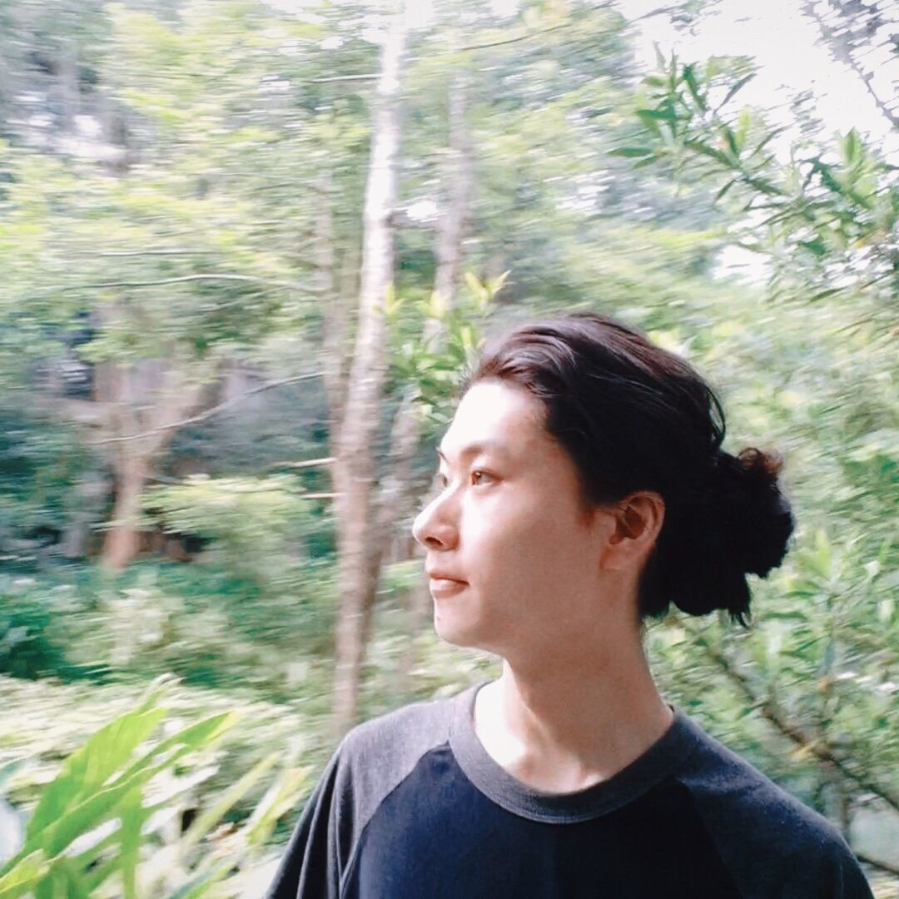
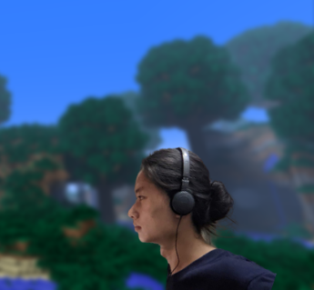

<!-- [//]: # (# Dreamtowards <small>"LI, PEIYANG"</small>  VoxelGameDev, Graphics, PL) -->
<!-- [//]: # (# About) -->

<!--  -->
<!--  -->
<!--  -->

Dreamtowards 
VoxelGameDev, Graphics, PL

 [YouTube](https://youtube.com/@dreamtowards)&nbsp;
 [Discord](https://discord.gg/k7ssbPJQnp)&nbsp;
 [Github](https://github.com/Dreamtowards)&nbsp;
 [Bilibili](https://space.bilibili.com/19483166)&nbsp;
 [Email](mailto:x@elytra.dev)&nbsp;
 [CV](https://elytra.dev/cv.pdf) 

Hi, I am Dreamtowards ('LI, PEIYANG' in law).
- Interest: VoxelGameDev, Graphics, Programming Language.
- Working: CyberDream. <!--former intern at ByteDance (gamedev position).-->
- Living: Shenzhen, CN.
- Birth: 2002.10, Nanchang.
  
#### Preferences

- Music: re:plus[Blue Sky](https://www.youtube.com/watch?v=6-QETns5W_Q) / Dennis Kuo[Blue Deja Vu](https://www.youtube.com/watch?v=l5YxW0GZmbg) / [C418](https://www.youtube.com/watch?v=DZ47H84Bc_Q) / [植松伸夫 Nobuo Uematsu]() / [colate](https://www.youtube.com/watch?v=Qdup0ujs9f0) / July
- Software: Minecraft Beta 1.7.3, Blender, CLion, Google Calendar 
- Movies: Inception / OtherLife / Interstellar / TENET / Spectral / The Imitation Game / Cloverfield / Maze Runner / Avatar / 2012

### External Links

Dev  
[VoxelGameDev](https://voxel.wiki/),
[Miguel Cepero](https://procworld.blogspot.com/),
[Sebastian Lague](https://www.youtube.com/channel/UCmtyQOKKmrMVaKuRXz02jbQ),
[Scratchapixel](https://www.scratchapixel.com/),
[0fps](https://0fps.net/),
[Yan Chernikov](https://thecherno.com/),
[Graham Edgecombe](https://minecraft-ids.grahamedgecombe.com/),
 
[Rising World](https://trello.com/b/t5Leypcj/rising-world-development),
[Up Void](https://upvoid.com/),

[Luna](https://github.com/Luna5ama)[(.dev)](https://about.luna5ama.dev/), 
[szszss](http://blog.hakugyokurou.net/?p=785),
[Saurlax](https://saurlax.com/),
[Clansty](https://clansty.com/),

Misc  
[Soartex Fanver](https://soartex.net/),
[Nolebase (VitePress Plugin, Blog of Neko, Ayaka)](https://nolebase.ayaka.io/%E7%AC%94%E8%AE%B0/),
[How-To-Ask-Questions-The-Smart-Way](https://github.com/ryanhanwu/How-To-Ask-Questions-The-Smart-Way/blob/main/README-zh_CN.md), 

### Lifetime Expereiences 

关于我的成长经历，

2024