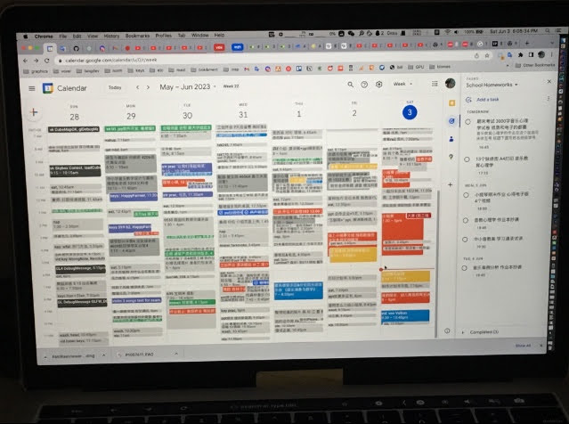

# Time Management · 时间管理大师

> 
> 2023.06 a Week Cal before a Competition 

## 技巧

### 1. Tracking Time 追踪时间

你不需要提前安排得事无巨细，因为事情永远在变 - 那些详细的安排可能会变成徒劳 除非你真的很在乎 比如某个约会安排 那你可以提前预演一下。

你需要的是，记录你现在在做什么 你刚才在做什么。这并不会浪费你十几秒的时间，但可以防止你Lost跟丢。
你还记得 1小时前你做了什么吗？这可能是模糊的，特别是你一个人的时候 至少我如果不记录做了啥 就比较容易跟丢。

然而一旦记录了 现在/之前做了什么，你自然就有个数 接下来该做什么，你可以评估当前的效率。

如果你有什么新想法 要做的事，可以大致的加个Todo Event到日历里(可能会随时修改时间)。

### 2. Documenting 记录文档

如果你有什么想法 感想 经历了什么valuable的事情。亦或在学什么，我喜欢用文档记录下来。
这有助于理清思路 加深理解 也有助于之后忘记时回看，有时这也可能是一笔宝贵的财富。

现代媒体，容易使你大脑乌烟瘴气 混乱不堪。当你一个人在家打开YouTube 看了一小时后，你还记得你看了啥吗？(假设是有声书 成长技巧思维分享型)  
我知道，你可能在需要的时候会想起某些片段。但或许大部分你都忘记了 你可能get到了某个概念 觉得比较认同，然后呢？消失了。

所以为了能有效吸收，

### 3. Meditation 宁静/"冥想"

如果头脑混乱 乌烟瘴气，亦或被情绪淹没。除了可以写下来 梳理理清 转成Todos待做事项。也可以尝试Meditation冥想。  
或者你只是单纯地冥想 为了训练。

Meditation冥想，其实是什么都不想 你可以把注意力放在呼吸 或身体扫描。如果有任何念头蹦出来 淡定地拉回到呼吸或自身，不用有其他额外的想法。你可以想象你坐在马路边 那些偶然出现的杂念就像经过的汽车，不用抓住纠缠 让它们开走吧。
> “冥想”这个翻译词，恐怕不是很准确 因为它本身并没有“想”。我更喜欢Meditation这个叫法 意味着“回归 平衡”。

初次接触，你可能以为这是什么邪教。但TED，等知名频道 也有在推荐这种方法。更重要的是其本身的作用原理。

#### 目的是什么 有什么用？

### 4. 规避风险

有几次我和 Thaumstrial 见面去玩，他说的几个观点 令我感到profound & novel。