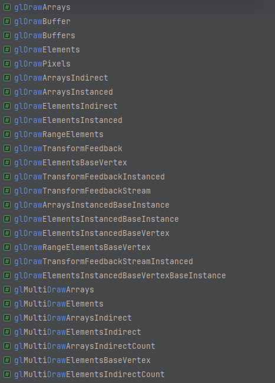

# All Draw Functions in OpenGL 4.6

截止目前最新的 OpenGL 4.6，共有这些DrawCall函数:


::: details ALL FUNCTIONS


P.S. glDrawBuffer(s) 不算，那是设置 RenderTarget 的
:::


## Overview

总的来说可以被分为 

- (Basic) Draw: 绘制单个对象   
  `glDrawArrays`, `glDrawElements`..
- MultiDraw: 一次调用 绘制多个(foreach-like)，避免状态切换/验证的开销
- Instanced Draw: 批量"重复"渲染 但引入gl_InstanceID或Instance VertexAttribute
- Indirect Draw (数据来自GPU  
- Transform Feedback Draw
- BaseInstance, BaseVertex


## I. Basic Draw

APIs:
```cpp
void glDrawArrays(GLenum mode, GLint first, GLsizei count);
void glDrawElements(GLenum mode, GLsizei count, GLenum type, const void * indices);
void glDrawRangeElements(GLenum mode, GLuint start, GLuint end, GLsizei count, GLenum type, const GLvoid * indices);

```

这些是最基本的绘制函数，通常用于渲染单个对象。


### 1. [glDrawArrays](https://docs.gl/gl4/glDrawArrays)

```cpp
void glDrawArrays(GLenum mode, GLint first, GLsizei count);
```
按照指定的图元类型绘制(如GL_TRIANGLES, GL_POINTS..)，从第first个顶点开始，绘制count个顶点。

#### 类似
- 类似于vulkan的`void vkCmdDraw(VkCommandBuffer commandBuffer,
uint32_t vertexCount,
uint32_t instanceCount,
uint32_t firstVertex,
uint32_t firstInstance))` (vk instancing draw也是用这个函数)
- 类似于wgpu的`pub fn RenderPass::draw(&mut self, vertices: Range<u32>, instances: Range<u32>)`

##### 用例1 - Use VAO, Full MainLoop
```cpp{7}
while(!glfwWindowShouldClose(window)) {
  glClear(GL_COLOR_BUFFER_BIT | GL_DEPTH_BUFFER_BIT);
  glUseProgram(shaderProgramId);
  glBindVertexArray(vao);
  
  // draw points 0-3 from the currently bound VAO with current in-use shader
  glDrawArrays(GL_TRIANGLES, 0, 3);
 
  glfwPollEvents();  // update other window events like input handling 
  glfwSwapBuffers(window);  // put the stuff we've been drawing onto the display
}
```
##### 用例2 - Non VAO
```cpp{5}
glBindBuffer(GL_ARRAY_BUFFER, vboId); // Bind VBO
glEnableVertexAttribArray(0);  // Enable Attribute 
glVertexAttribPointer(0, 3, GL_FLOAT, GL_FALSE, 0, 0); // specifying VertexData layout

glDrawArrays(GL_POINTS, 0, 3); 

glDisableVertexAttribArray(0); 
glBindBuffer(GL_ARRAY_BUFFER, 0); //Unbind
```

### 2. [glDrawElements](https://docs.gl/gl4/glDrawElements)

```cpp
void glDrawElements(GLenum mode, GLsizei count, GLenum type, const void * indices);
```

最后一个参数 `const void* indices`可能有点[令人迷惑](https://stackoverflow.com/questions/21706113/the-4th-argument-in-gldrawelements-is-what), 这分两种情况:
- 你绑定了 GL_ELEMENT_ARRAY_BUFFER E(V)BO: 那么这个 indices 将会作为 GL_ELEMENT_ARRAY_BUFFER (Indices VBO)的 byte offset (本质上是个int，但传入时要转成pointer)  
  所以0或nullptr就是无偏移，如果4且你的index type是GL_UNSIGNED_INT (u32), 那么就偏移1个index
- 如果你没绑定 GL_ELEMENT_ARRAY_BUFFER (且VAO也没这EBO), 那么这个参数就是个指向索引数据内存的指针 (而不是像上面那样一个int数值 假扮的指针)

##### 类似
- vulkan `void vkCmdDrawIndexed(
VkCommandBuffer                             commandBuffer,
uint32_t                                    indexCount,
uint32_t                                    instanceCount,
uint32_t                                    firstIndex,
int32_t                                     vertexOffset,
uint32_t                                    firstInstance);`
- wgpu `pub fn RenderPass::draw_indexed(
&mut self,
indices: Range<u32>,
base_vertex: i32,
instances: Range<u32>,
)`

##### 用例1 - Use VAO:
```cpp{4}
glUseProgram(shaderProgramId);
glBindVertexArray(vao);

glDrawElements(GL_TRIANGLES, 6, GL_UNSIGNED_INT, 0);
```

::: details 用例2 - Non VAO:
```cpp{25}
glBindBuffer(GL_ARRAY_BUFFER, vertex_buffer); // vertex_buffer is retrieved from glGenBuffers
glBindBuffer(GL_ELEMENT_ARRAY_BUFFER, index_buffer); // index_buffer is retrieved from glGenBuffers

glEnableVertexAttribArray(texcoord_attrib_index); // Attribute indexes were received from calls to glGetAttribLocation, or passed into glBindAttribLocation.
glEnableVertexAttribArray(normal_attrib_index);
glEnableVertexAttribArray(position_attrib_index);

// vertex_stride is the size of bytes of each vertex in the buffer object
// vertex_position_offset and kin are the offset in bytes of the position data
// in each vertex. For example if your vertex structure is
// [ position, texcoord, normal ] then position vertex_position_offset will
// have offset 0, vertex_texcoord_offset is 12 (position is 3 * sizeof(float)
// bytes large, and texcoord comes just after) and vertex_normal_offset is
// 20 = 5 * sizeof(float).
GLintptr vertex_texcoord_offset = 3 * sizeof(float);
GLintptr vertex_normal_offset = 5 * sizeof(float);
GLintptr vertex_position_offset = 0 * sizeof(float);

glVertexAttribPointer(texcoord_attrib_index, 2, GL_FLOAT, false, vertex_stride, (GLvoid*)vertex_texcoord_offset);
glVertexAttribPointer(normal_attrib_index, 3, GL_FLOAT, false, vertex_stride, (GLvoid*)vertex_normal_offset);
glVertexAttribPointer(position_attrib_index, 3, GL_FLOAT, false, vertex_stride, (GLvoid*)vertex_position_offset);

// num_vertices is the number of verts in your vertex_data.
// index_data is an array of unsigned int offsets into vertex_data.
glDrawElements(GL_TRIANGLES, num_vertices, GL_UNSIGNED_INT, NULL);

```
:::

::: details 实现隐喻
```cpp
GLvoid *elementArray;

void glDrawElements(GLenum type, GLint count, GLenum type, GLsizeiptr indices) {
    GLtype *ourElementArray = (type*)((GLbyte *)elementArray + indices);
    
    for(GLint elementIndex = 0; elementIndex < count; elementIndex++) {
        GLint element = ourElementArray[elementIndex];
        VertexShader(positionAttribArray[element], colorAttribArray[element]);
    }
}
```
from [arcsynthesis](https://web.archive.org/web/20150225192608/http://www.arcsynthesis.org/gltut/Positioning/Tutorial%2005.html#:~:text=Example%C2%A05.2.%C2%A0Draw%20Elements%20Implementation)
:::

### 2.1 [glDrawRangeElements](https://docs.gl/gl4/glDrawRangeElements)

```cpp
void glDrawRangeElements(GLenum mode, GLuint start, GLuint end, GLsizei count, GLenum type, const GLvoid * indices);
```
(没啥用) 这是`glDrawElements`的一个变种。注意这个 start/end 指定的Range(indices subset) 是最小和最大的的index **value**而不是index **index**。  
比如我有个EBO只包含3个元素 [200, 201, 202]. 此时我为了渲染这3个元素 应该这样用: `glDrawElements(mode, 200, 202, 3, type, data)`  
所以end-start并不等于count，(int)indices也并不等于start。

::: details 见讨论

https://stackoverflow.com/questions/7549991/questions-about-gldrawrangeelements

Are these two equivalent: glDrawElements(mode, end-start, type, data + start) and glDrawRangeElements(mode, start, end, end-start, type, data)?

From the answer provided and the docs, it sounds like those are equivalently in that both are wrong. If you have an index buffer with 3 elements in it, and the index values contained in the index buffer are 200, 201, and 202, a proper call would look like: glDrawElements(mode, 200, 202, 3, type, data); It could also look like this: glDrawElements(mode, 100, 500, 3, type, data);, but it cannot look like this: glDrawElements(mode, 0, 2, 3, type, data); or glDrawElements(mode, 0, 3, 3, type, data); because the actual values are not between 0 and 2 (or 3).

I realized the "Range" in the name "glDrawRangeElements" bears the same meaning as in "Range Query" --- that is to find a subset of values that fall in the range, not the subset of indices that fall in the range !
:::

##### Example1: 
```cpp
glDrawRangeElements(GL_TRIANGLES, 400, 452, 29, GL_UNSIGNED_BYTE, NULL);
```

### 3. [glDrawPixels](https://registry.khronos.org/OpenGL-Refpages/gl2.1/xhtml/glDrawPixels.xml)

```cpp
void glDrawPixels(GLsizei width, GLsizei height, GLenum format, GLenum type, const void * data);
```
write a block of pixels to the frame buffer


```cpp
GLubyte* PixelBuffer = new GLubyte[WIDTH * HEIGHT * 3];
...
glDrawPixels(WIDTH, HEIGHT, GL_RGB, GL_UNSIGNED_BYTE, PixelBuffer);
```


## II. Multi Draw

APIs:
- glMultiDrawArrays(Indirect|IndirectCount)
- glMultiDrawElements(Indirect|IndirectCount|BaseVertex)
> MultiDraw 不交集 Instanced, 但交集 Indirect *2, IndirectCount *2, BaseVertex *1
```cpp
void glMultiDrawArrays(GLenum mode, const GLint * first, const GLsizei * count, GLsizei drawcount); 
void glMultiDrawElements(GLenum mode, const GLsizei * count, GLenum type, const void * const * indices, GLsizei drawcount);
void glMultiDrawArraysIndirect(GLenum mode, const void *indirect, GLsizei drawcount, GLsizei stride);
void glMultiDrawElementsIndirect(GLenum mode, GLenum type, const void *indirect, GLsizei drawcount, GLsizei stride);
void glMultiDrawArraysIndirectCount(GLenum mode, const void *indirect, GLintptr drawcount, GLsizei maxdrawcount, GLsizei stride);
void glMultiDrawElementsIndirectCount(GLenum mode, GLenum type, const void *indirect, GLintptr drawcount, GLsizei maxdrawcount, GLsizei stride);
```

### MultiDraw的用途 目的 意义是什么？  
"只是"为了更好的性能 减少API调用 减少状态切换，而不是为了更多的功能。它在功能性上 等同于for each多次调用Draw，如下：
```cpp
void glMultiDrawArrays(GLenum mode, const GLint * first, const GLsizei * count, GLsizei drawcount); 
void glMultiDrawElements(GLenum mode, const GLsizei * count, GLenum type, const void * const * indices, GLsizei drawcount);

// 相当于
void glMultiDrawArrays(GLenum mode, const GLint * first, const GLsizei * count, GLsizei drawcount) {
    for (int i = 0; i < drawcount; ++i) {
        if (count[i] > 0)
            glDrawArrays(mode, fisrt[i], count[i]);
    }       
}
void glMultiDrawElements(GLenum mode, const GLsizei * count, GLenum type, const void * const * indices, GLsizei drawcount) {
    for (int i = 0; i < drawcount; ++i) {
        if (count[i] > 0)
            glDrawArrays(mode, count[i], type, indices[i]);
    }       
}
```
也就是并没有提供更多功能，而是为了性能。

### MultiDraw 如何提升性能

一次性绘制多个(相同VAO 但不同顶点数据"范围"的)对象，

减少OpenGL函数调用/验证/状态切换的开销：通过仅进行一次绘制调用，驱动程序（理论上）只需执行一次设置和验证，而不是每次绘制调用执行一次。
甚至可能优化数据传输 指令编码。

不过上面都是“理论上”，因为在实践中，它的性能将取决于驱动程序如何实现它。一些驱动程序可能完全在软件中实现它，并将其视为单个 glDrawArrays 调用的循环。其他人可能能够采用更快的路径。OpenGL 对此不作任何承诺。


 
#### 用例

```cpp{22}
// 定义顶点数据
GLfloat vertices[] = {
    // First Object (Triangle)
    -0.5f, 0.0f, 0.0f,
     0.0f, 0.5f, 0.0f,
     0.5f, 0.0f, 0.0f,
    // Second Object (Triangle)
    -0.75f, -0.5f, 0.0f,
     0.0f, -0.75f, 0.0f,
     0.75f, -0.5f, 0.0f
};

// 假设已经设置好 VAO 和 VBO

// MultiDrawArrays 参数设置
GLint first[] = { 0, 3 };
GLsizei count[] = { 3, 3 };

// 使用 glMultiDrawArrays 绘制两个独立的三角形
glMultiDrawArrays(GL_TRIANGLES, first, count, 2);
```


## III. Instanced Draw

APIs:
- glDrawArraysInstanced(BaseInstance)
- glDrawElementsInstanced(BaseVertex)(+)(BaseInstance)
- glDrawTransformFeedback(Stream)Instanced

```cpp
void glDrawArraysInstanced(GLenum mode, GLint first, GLsizei count, GLsizei primcount);
void glDrawElementsInstanced(GLenum mode, GLsizei count, GLenum type, const void * indices, GLsizei instancecount);
void glDrawArraysInstancedBaseInstance(GLenum mode, GLint first, GLsizei count, GLsizei instancecount, GLuint baseinstance);
void glDrawElementsInstancedBaseInstance(GLenum mode, GLsizei count, GLenum type, const void *indices, GLsizei instancecount, GLuint baseinstance);
void glDrawElementsInstancedBaseVertexBaseInstance(GLenum mode, GLsizei count, GLenum type, void *indices, GLsizei instancecount, GLint basevertex, GLuint baseinstance);
```

如果你要绘制大量相同顶点数据、材质(Shader)的物体 - 比如大量小行星 粒子效果，那么Instancing将是一个很好的选择。  
附：性能差距视频

网上有许多优秀的讲OpenGL Instancing的文章，比如
[LearnOpenGL - Instancing](https://learnopengl.com/Advanced-OpenGL/Instancing), [ThinMatrix - Instancing](https://www.youtube.com/watch?v=Rm-By2NJsrc)。
但这里也总结概括一下，

### 两种方法 Instance VertexAttribute or Uniform

#### 方法1 - Instance Arrays (VBO VertexAttribute)

Host (C++):
```cpp
unsigned int instanceVBO;
glGenBuffers(1, &instanceVBO);
glBindBuffer(GL_ARRAY_BUFFER, instanceVBO);
glBufferData(GL_ARRAY_BUFFER, sizeof(glm::vec2) * 100, &translations[0], GL_STATIC_DRAW);
glBindBuffer(GL_ARRAY_BUFFER, 0); 

glEnableVertexAttribArray(2);
glBindBuffer(GL_ARRAY_BUFFER, instanceVBO);
glVertexAttribPointer(2, 2, GL_FLOAT, GL_FALSE, 2 * sizeof(float), (void*)0);
glBindBuffer(GL_ARRAY_BUFFER, 0);	
glVertexAttribDivisor(2, 1);  // IMPORTANT! set vertex-attribute-2 with attribute-divisor 1. 2=update every 2 instances 

glDrawArraysInstanced(GL_TRIANGLES, 0, 6, 100);  
```

Shader (GLSL): 
```glsl
layout (location = 2) in vec3 instancePos;
```

#### 方法2 - Uniform + gl_InstanceID
缺点: 不推荐超过100个(如300个可能会崩溃或慢)，因为uniform数据内存很有限。
然而instancing渲染上万个都有可能，因此这种方法是比较有限制的。

Host (C++):
```cpp
shader.use();
for(unsigned int i = 0; i < 100; i++)
{
    shader.setVec2(("instancePos[" + std::to_string(i) + "]")), translations[i]);
}  

glBindVertexArray(quadVAO);
glDrawArraysInstanced(GL_TRIANGLES, 0, 6, 100);  
```

Shader (GLSL):
```glsl
uniform vec3 instancePos[100];
...
vec3 pos = instancePos[gl_InstanceID];
```


## IV. Indirect Draw

APIs:
```cpp
void glDrawArraysIndirect(GLenum mode, const void *indirect);
void glDrawElementsIndirect(GLenum mode, GLenum type, const void *indirect);
// MultiDraw Indirect, Since GL 4.3 or ARB_multi_draw_indirect Extension Enabled.
void glMultiDrawArraysIndirect(GLenum mode, const void *indirect, GLsizei drawcount, GLsizei stride);
void glMultiDrawElementsIndirect(GLenum mode, GLenum type, const void *indirect, GLsizei drawcount, GLsizei stride);
void glMultiDrawArraysIndirectCount(GLenum mode, const void *indirect, GLintptr drawcount, GLsizei maxdrawcount, GLsizei stride);
void glMultiDrawElementsIndirectCount(GLenum mode, GLenum type, const void *indirect, GLintptr drawcount, GLsizei maxdrawcount, GLsizei stride);
```

Indirect Draw直接渲染GPU中的数据，省去GPU->CPU->GPU的拷贝过程。
运行时数据来源可能是Compute Shader，也可能是Geometry Shader + Transform Feedback，甚至可能是OpenCL/CUDA。


### glDrawArraysIndirect

### glDrawElementsIndirect

### glMultiDrawArraysIndirect

### glMultiDrawElementsIndirect

### glMultiDrawArraysIndirectCount

### glMultiDrawElementsIndirectCount


## V. Base Vertex, Base Instance

### glDrawElementsBaseVertex

### glDrawArraysInstancedBaseInstance

### glDrawElementsBaseInstance

### glDrawElementsBaseVertex

### glDrawElementsInstancedBaseVertexBaseInstance


## VI. Transform Feedback (Stream)

APIs:
```cpp

```

### glDrawTransformFeedback(Stream)(+)(Instanced)


## VII. Conditional Rendering

APIs:
```cpp
void glBeginConditioinalRender(GLuint id, GLenum mode);
void glEndConditionalRender(void);
```
[glBeginConditionalRender](https://docs.gl/gl4/glBeginConditionalRender) 
只满足特定条件下渲染，避免不必要的绘制，从而提高性能。
典型用途是 Occlusion Query。 

支持的命令:
- All Draw Functions: glDraw*, glMultiDraw*
- glClear, glClearBuffer
- glDispatchCompute, glDispatchComputeIndirect.

id: 用于条件判断的 QueryId（如 GL_SAMPLES_PASSED Query）

mode:   
- GL_QUERY_WAIT: 等待查询完成，如果条件满足则执行渲染。OpenGL will wait until the query result is returned, then decide whether to execute the rendering command. This ensures that the rendering commands will only be executed if the query fails. Note that it is OpenGL that’s waiting, not (necessarily) the CPU.
- GL_QUERY_NO_WAIT: 不等待查询完成，但如果已经完成且条件满足则执行渲染。OpenGL may execute the rendering commands anyway. It will not wait to see if the query test is true or not. This is used to prevent pipeline stalls if the time between the query test and the execution of the rendering commands is too short.
- GL_QUERY_BY_REGION_WAIT: OpenGL will wait until the query result is returned, then decide whether to execute the rendering command. However, the rendered results will be clipped to the samples that were actually rasterized in the occlusion query. Thus, the rendered result can never appear outside of the occlusion query area.
- GL_QUERY_BY_REGION_NO_WAIT: As above, except that it may not wait until the occlusion query is finished. The region clipping still holds.

#### 用例:

```cpp 
...
// 创建查询对象
GLuint query;
glGenQueries(1, &query);

// 渲染循环
while (!glfwWindowShouldClose(window)) {
    glClear(GL_COLOR_BUFFER_BIT);

    // 启动查询
    glBeginQuery(GL_SAMPLES_PASSED, query);

    // 绘制三角形来测试条件
    glBindVertexArray(VAO);
    glDrawArrays(GL_TRIANGLES, 0, 3);

    // 结束查询
    glEndQuery(GL_SAMPLES_PASSED);

    // 开始条件渲染
    glBeginConditionalRender(query, GL_QUERY_WAIT);

    // 在条件满足的情况下绘制三角形
    glDrawArrays(GL_TRIANGLES, 0, 3);

    // 结束条件渲染
    glEndConditionalRender();

    glfwSwapBuffers(window);
    glfwPollEvents();
}

// 清理资源
glDeleteVertexArrays(1, &VAO);
glDeleteBuffers(1, &VBO);
glDeleteQueries(1, &query);
```

### Resources

> https://www.bilibili.com/read/cv1823723/