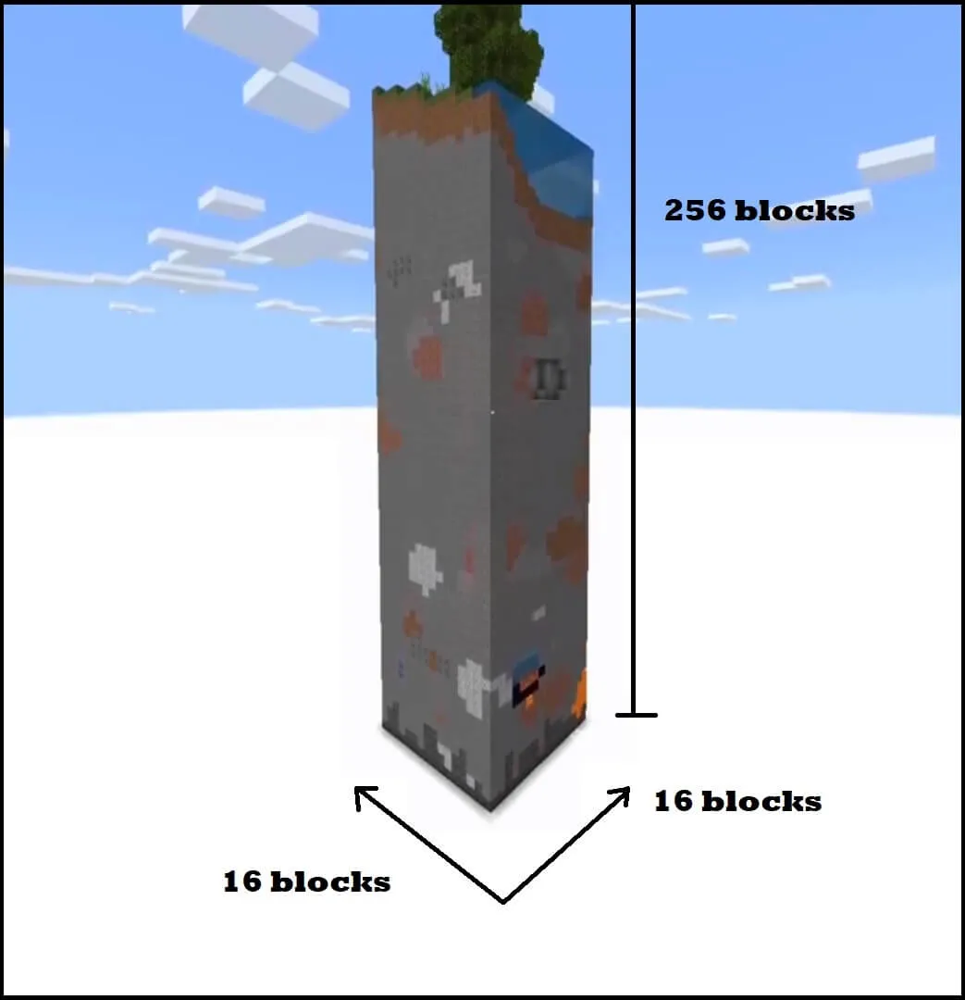
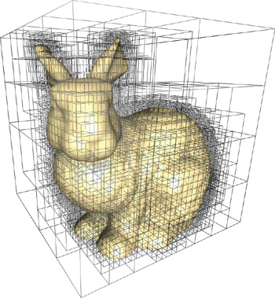

# Runtime Store

<!-- 本文介绍 体素系统在运行时的数据结构。 -->

## I. Big Array

<!--  -->

e.g. `uint8[256*128*256]`  
- 好处：简单？！
- 坏处：
    1. 有限世界
    2. 灵活性的缺失 内存浪费 (如大量空气块不能被省略)  

## II. Chunks (Unified-Size)

把世界分为无数个Chunk大块 (统一尺寸，可以是方形区块e.g.16x16x16 或是MC的垂直区块e.g.16x256x16)，用他们组成世界。  
这样你不需要一次性加载所有，而是可以分Chunk加载和卸载。

### 1. Vertical Chunk 垂直区块

这些区块较高，XZ横向排列，Y竖向只有一个。(典型尺寸: 16x256x16)

 

> MC就是典型的垂直区块代表。在1.20版之前一直是 16x256x16的区块大小 (之后改成了384格高 - 顶底各加了64)。  
> 不过MC内部还是用16^3的"Section"结构来存储(both for 内存和硬盘, 空区块不会占内存)和渲染的。

#### 优点 "垂直连贯性"

1. 如果最顶部有一片遮天屋顶，由于垂直全部加载了。因此顶部的阴影会被正确投下来 - 无论是渲染上(Mesh, ShadowMapping), 或是逻辑上(Voxel SkyLight)
2. 或其他遍历相关的 比如寻找最高点；或地形生成Population选择表面方块时要知晓上面N格后是空气
3. 或玩家从高空落下 由于下面都已被加载了 因此掉下来会很流畅(无论是视觉上还是物理上) 不会卡加载。

不过这几个‘优点’，下面的方形区块都有对应的解决方法 或许还是更彻底的解决方法。然而垂直区块由于其特质性，存在几个有点致命的弊端：

#### 缺点 (灵活性/扩展性缺失)

1. 缺失扩展性: 垂直轴定多高合适？256? 384? 真的够吗? 如果你要做大海拔高山阔望..
2. 缺失灵活性: 假设你要512格高 那你地形生成时要全生成这么高吗？那会不会很慢 又占内存和存储空间。
[图片]

---

### 2. Cubical Chunk 方形区块

方形区块的长宽高一致。XYZ三个轴均可排列 因此Y垂直轴也可以像XZ横向轴那样"无限"。  
长度一般是16^3 (16长宽高) 或32^3的区块 (少有更大或更小的)。

#### 优点：

1. 真的很高!：现在Y轴也像XZ轴一样广阔无垠了。你甚至可以生成"天堂"(MC里的末地或以太Mod)，"地狱"在同一个世界里可能都不成问题。
2. 按需加载：虽然Y轴巨大了 但你并不需要生成或加载那么多 而只需要加载范围内的 - 就像XZ轴一样。因此性能上也可以更好。

对应上面的VerticalChunk的“垂直连贯性”，此处的解决方法：

1. LoD支持: 如果很高处有东西 你未必要完全加载到他们才能显示他们。而是可以缓存LoD就可以看到他们。
2. 遍历时 可以每个区块缓存相邻区块的指针 即可快速访问。
3. 下落时的加载速度 - 只要视野范围开的够大 就不影响。然而上面VerticalChunks的代价是 横向移动时要加载全部竖向区块 这是不小的性能开销。

### Chunk Size 区块尺寸的选择

一般来说，如果你的区块系统是由Unified Chunks固定长度区块组成的，那么一般是2^n的区块尺寸，最为常见的是 16, 32, 8. 因为这些数值可以用位操作加速乘除取模运算。并且这些数字看上去也不错。

::: tip TIP: `2^n` 区块位置 加速计算

以16长宽高区块举例
1. 乘: `fn mul16(x) { x << 4 } var worldpos = mul16(chunkpos)`
2. 除: `fn div16(x) { x >> 4 } var chunkpos = div16(worldpos)`
3. 模: `fn mod16(x) { x & 15 } var localpos = mod16(worldpos)`
4. ?: `fn floor16(x) { x & (!15) } var worldpos_chunkbase = floor16(worldpos)`

不过现代计算机 一般用不着为这些轻量计算节省性能 - 性能瓶颈往往不在于此。

:::

## 3. SVO - Sparse Voxel Octree 稀疏八叉树

#### 优点：
1. 节省内存: 通过层次化的八叉树结构，仅存储有意义的体素，避免浪费空间。
2. "无限细节"！可存储高分辨率场景: 能够在较大范围内有效地管理稀疏数据，适合存储复杂的细节。
3. 加速射线投射

#### 缺点：
1. 邻居遍历效率
2. 指针跳转 cache miss

::: details luna

> SVO主要适合 不同大小的体素(小可以更改的单位)，而不是mc这种统一大小的体素  
(额当然mc这种也不是不行 一个方块作为svo最小级别 没那么小的体素就不用那么深的节点存 但是又有个大问题就是mc里有些奇怪的方块
比如栅栏这种 并不是一个完整的方块 还有草 甚至都没有体积
gpu端用svo还有个大问题就是动态的东西不能赛里面 不说实体和粒子啥的了 被风吹动的草和树叶这种也有麻烦)

单纯用来cpu端存储数据或者gpu端用也行
渲染这方面的优势就是方便做lod还有光追
但好像只适合存世界的一部分不能存整个世界

区块内SVO，主要还是太小了 svo光追啥的优势发挥不出来。之前群里发过的那个 voxtoplis 就是败在了这一点上
没法用来做各种光追的话那在gpu上用svo几乎没有任何优势

svo其实单纯渲染用的话效率不怎么高 或者说单纯渲染几何/直接光 用来跑光追做全局照明这些才会有价值 因为局部性挺差的 (涉及到光追的东西)
渲染几何其实还是不如光栅化网格 当然还是得配合上lod来渲染远处地形网格
软光栅也只是软景渲染的效率下降减缓了一点点而已 最后也还是会因为面数太多遇到内存/计算瓶颈 软光栅解决的是硬件光栅管线瓶颈

:::

## 4. SDF - Signed Distance Field 距离场

> 据说 VoxelFarm 就是 SVO\<SDF>，所以可以无限细节 远距离快速加载 CSG操作